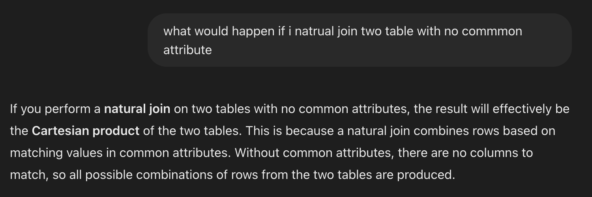
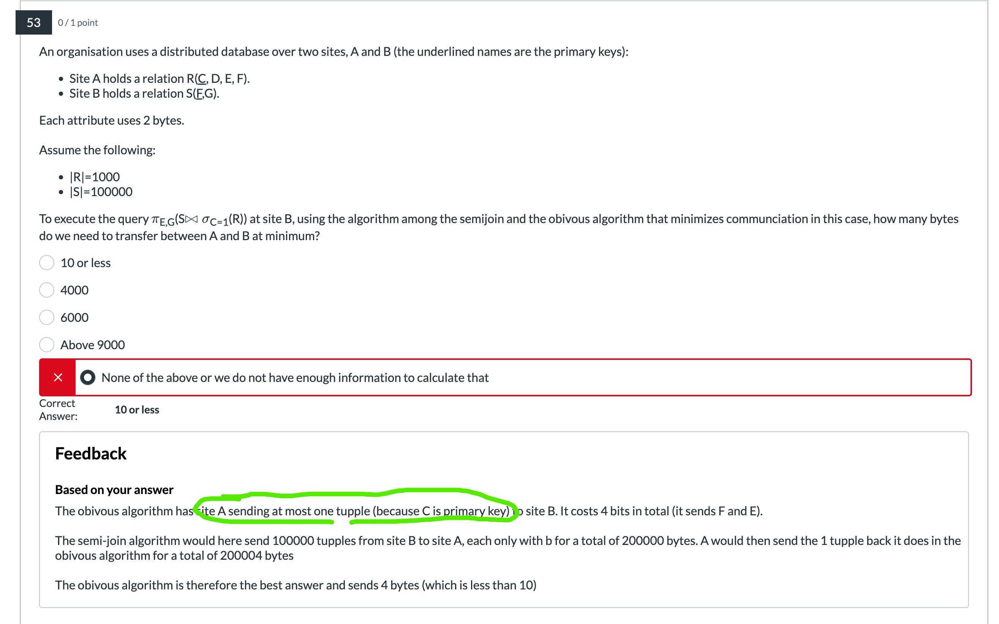

# Database development

## Transaction control

### Transaction and Schedule

- Q1
> 1. Note, short hand notation only cares write and read operation, and ignores calculations. So two identical short hand schedule may have different result.  
{width=700px}
{width=700px}

- *Equivalent*  
Conflict equivalence focus on Order of conflicting operations. Two schedules are conflict-equivalent if:
      - They involve the same set of transactions.
      - They have the same operations in the same order for conflicting operations (read-write, write-read, write-write on the same data item).

- *Serializable*
      - Best by represent precedence graph, and find the path
      - **2PL guarantees serializable**. While normal locks don't.

### ACID
1. Q1
> 1. Pay attention to "read" or "write" operation. -- "check" or "update" 
> 2. By default consider all update operations are reflected to non-volatile memory 
> 3. Durability: Durability consider whether a update that considered as committed (by schedule or by log file) is missing.  
> i.e. *If the system commits a transaction but does not actually write the data (or logs) to non-volatile storage, then a power loss or crash could erase the changes. This breaks durability because the transaction’s changes are not permanently saved.*   
> Since in the question all updates (even half-executed) are saved to non-volatile memory (which breaks atomicity), durability is not violated.  
{ width=700px }

2. What Ensures ACID? 
- Isolation ensures that intermediate states of a transaction are not visible to other transactions. (Serial guarantees isolation)
    - Locks
    - MVCC

- Atomicity ensures that a transaction is all-or-nothing. Either all its operations are completed, or none of them are.
    - Undo Logging
    - Undo/Redo logging

- Durability ensures that once a transaction commits, its changes are permanent, even in the event of a system crash.
    - Logging
    - Checkpoint
    - Redo logging
    - Un/re logging

### Logging protocol

1. Q1
> 1. Undo/Redo logging -- both D & A 
> 2. Force -- Durability, all committed updates are forces to reflected in non-volatile
> 3. No Steal -- Atomicity, NO STEAL policy ensures that dirty pages (pages modified by uncommitted transactions aka. half-done updates) are not written to disk before the transaction commits.  
{ width=700px }

2. Q2
> 1. I think he is bullshitting.
> 2. 找补: The file structure is identical, so it is possible to recover a redo log file under undo protocol.  
{width=700px}

3. Q3
> 1. You can't apply redo or undo protocol on undo/redo log file since the data structure is not compatible.  
{width=700px}

4. Q4
> 1. The expected starting log index satisfy:  
> (1) CHECKPOINT & END CHECKPOINT both occurs after it  
> (2) It is a Start log or the first line  
> (3) It is the start log of the first uncommitted checking txn
{width=700px}

### Recoverability (safety)
This part consider about recoverability, focusing on operation to one shared item, and have nothing to do with serializable.

| **Property**     | **Key Condition**                                                                                 | **Implication**                                                                                        |
|------------------|---------------------------------------------------------------------------------------------------|--------------------------------------------------------------------------------------------------------|
| **Recoverable** (RC)  | A transaction that has read uncommitted data must commit *after* the writer commits.              | Prevents the committed transaction from depending on a later-aborted transaction.                     |
| **Cascadeless** (CC)  | No transaction reads uncommitted data (i.e., reads only committed values).                        | Prevents “cascading” aborts; also implies RC (recoverable).                                           |
| **Strict** (ST)       | No transaction reads **or writes** data written by an uncommitted transaction.                   | Strongest condition; implies CC (and thus RC). Simplifies recovery by avoiding any use of uncommitted data. |

- Strict 2PL: All **exclusive** (write) locks are held by a transaction until that transaction commits or aborts.
- Strict 2PL ensures strict schedule, but basic 2PL doesn't.
- Strict 2PL doesn't ensure serial. Since 2PL focus on Isolation when two txn touch one item.  
You can have interleaved txns touching different items
- Strict >> Cascadeless >> Recoverable

- Example:
    -  not recoverable: w1(X) r2(X) c2 c1
    - recoverable: w1(X) w2(X) r2(X) c2 c1.  
    Since what T2 read is previously modified by itself. In other word, T2 doesn't depend on T1
    - cascading: w1(X) r2(X) c1 c2.  
    Aborting T1 should roll back T2 as well since T2 depends on T1
    - cascadeless: w1(X) w2(X) c1 c2.     
    Aborting T1 will not affect T2, since T2 doesn't depend on T1

### Timestamp 
- Timestamp helps Detecting deadlock and make scheduler to abort some txn
      - Wait-Die: If older waits for younger, older wait. If younger wait for older, younger roll back and abort (not allowed).  
      only older transactions are allowed to wait, so no cyclic dependencies created
      - Would-Wait: If older wait for younger, younger roll back. If younger wait for older, younger wait.  
      only younger transactions are allowed to wait, so no cyclic dependencies created

- Timestamp to prevent dead lock
    - Prevent (abort and restart) read request of an item if it is written in the future
    - Prevent (abort and restart) write request of an item if it is read or written in the future

- MVCC:
    - Each txn keeps a copy of dirty page
    - Grant all read request to txns
    - Grand write request only if items is NOT read in the future, otherwise abort and restart