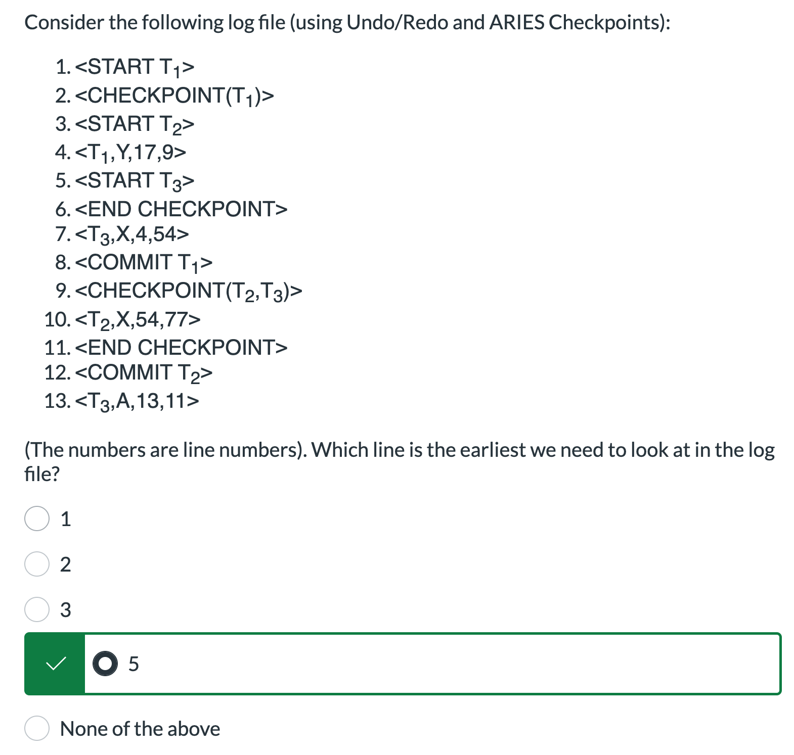
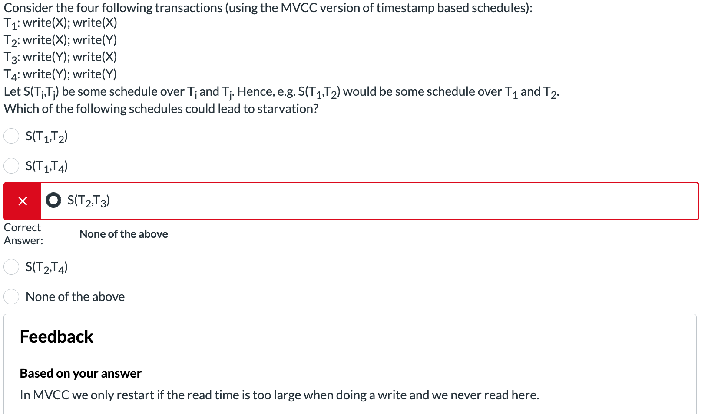
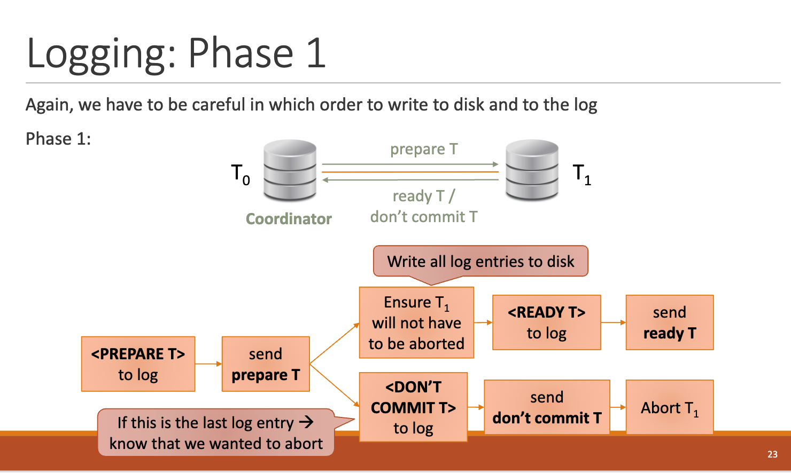
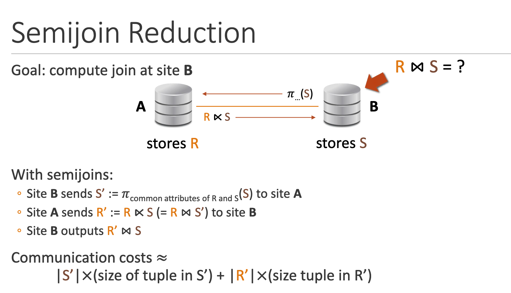
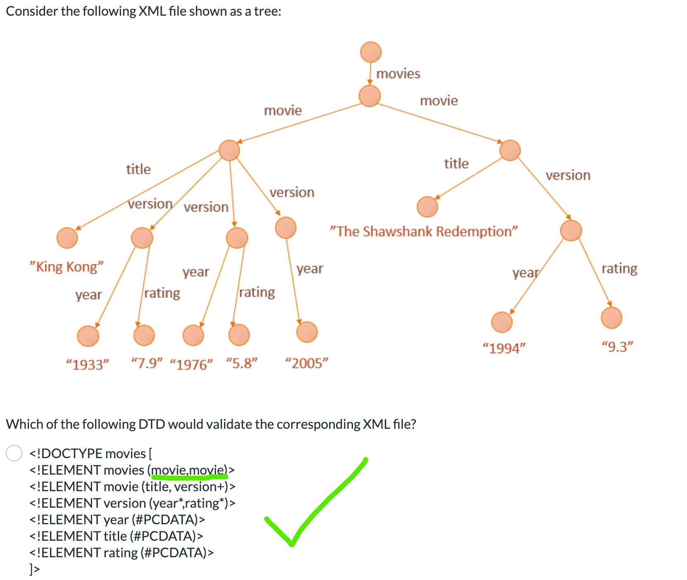
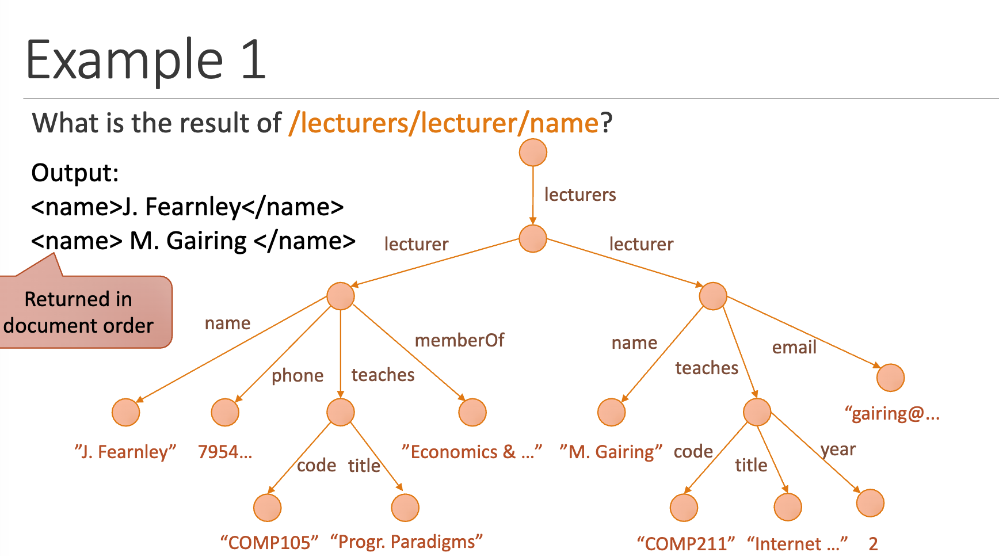
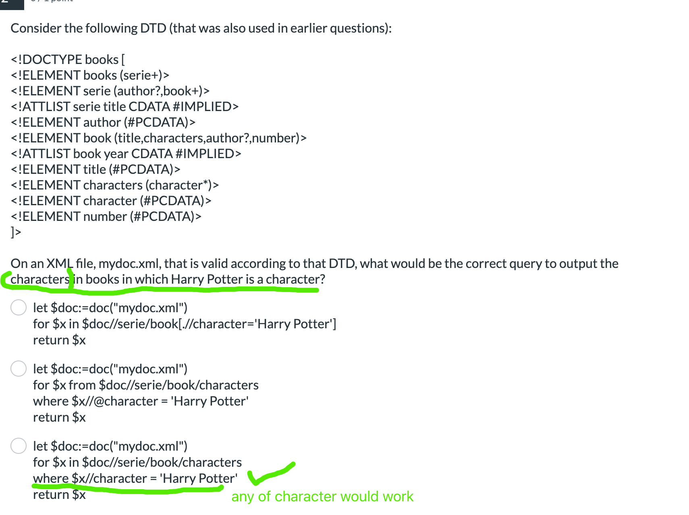
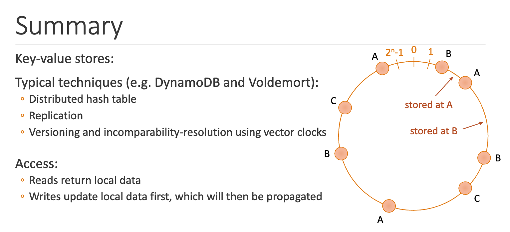

# Database development

## SQL


## Transaction control

### Transaction and Schedule

- Q1
> 1. Note, short hand notation only cares write and read operation, and ignores calculations. So two identical short hand schedule may have different result.  
{width=700px}
{width=700px}

- *Equivalent*  
Conflict equivalence focus on Order of conflicting operations. Two schedules are conflict-equivalent if:
      - They involve the same set of transactions.
      - They have the same operations in the same order for conflicting operations (read-write, write-read, write-write on the same data item).

- *Serializable*
      - Best by represent precedence graph, and find the path
      - **2PL guarantees serializable**. While normal locks don't.
      - Ex. S: r1(X); w1(X); r2(Y); w3(Z); r3(X); c3; c1; r2(Z); c2;  
      Is NOT serial. It is not one txn after another

### ACID
1. Q1
> 1. Pay attention to "read" or "write" operation. -- "check" or "update" 
> 2. By default consider all update operations are reflected to non-volatile memory 
> 3. Durability: Durability consider whether a update that considered as committed (by schedule or by log file) is missing.  
> i.e. *If the system commits a transaction but does not actually write the data (or logs) to non-volatile storage, then a power loss or crash could erase the changes. This breaks durability because the transaction’s changes are not permanently saved.*   
> Since in the question all updates (even half-executed) are saved to non-volatile memory (which breaks atomicity), durability is not violated.  
{ width=700px }

2. ==What Ensures ACID==? 
- Isolation ensures that intermediate states of a transaction are not visible to other transactions. (Serial guarantees isolation)
    - Locks
    - MVCC

- Atomicity ensures that a transaction is all-or-nothing. Either all its operations are completed, or none of them are.
    - Undo Logging
    - Undo/Redo logging

- Durability ensures that once a transaction commits, its changes are permanent, even in the event of a system crash.
    - Logging
    - Checkpoint
    - Redo logging
    - Un/re logging

### Logging protocol

1. Q1
> 1. Undo/Redo logging -- both D & A 
> 2. Force -- Durability, all committed updates are forces to reflected in non-volatile
> 3. No Steal -- Atomicity, NO STEAL policy ensures that dirty pages (pages modified by uncommitted transactions aka. half-done updates) are not written to disk before the transaction commits.  
{ width=700px }

2. Q2
> 1. I think he is bullshitting.
> 2. 找补: The file structure is identical, so it is possible to recover a redo log file under undo protocol.  
{width=700px}

3. Q3
> 1. You can't apply redo or undo protocol on undo/redo log file since the data structure is not compatible.  
{width=700px}

4. Q4
> 1. The expected starting log index satisfy:  
> (1) CHECKPOINT & END CHECKPOINT both occurs after it  
> (2) It is a Start log or the first line  
> (3) It is the start log of the first uncommitted checking txn
{width=700px}

5. Checkpoint
      1. Can be used to make the size of log file smaller
      2. ARIES checkpoint does not necessarily slower than simple checkpoints
{width=700px}

### Recoverability (safety)
This part consider about recoverability, focusing on operation to one shared item, and have nothing to do with serializable.

| **Property**     | **Key Condition**                                                                                 | **Implication**                                                                                        |
|------------------|---------------------------------------------------------------------------------------------------|--------------------------------------------------------------------------------------------------------|
| **Recoverable** (RC)  | A transaction that has read uncommitted data must commit *after* the writer commits.              | Prevents the committed transaction from depending on a later-aborted transaction.                     |
| **Cascadeless** (CC)  | No transaction reads uncommitted data (i.e., reads only committed values aka dirty read).                        | Prevents “cascading” aborts; also implies RC (recoverable).                                           |
| **Strict** (ST)       | No transaction reads **or writes** data written by an uncommitted transaction.                   | Strongest condition; implies CC (and thus RC). Simplifies recovery by avoiding any use of uncommitted data. |

- Strict 2PL: All **exclusive** (write) locks are held by a transaction until that transaction commits or aborts.
- Strict 2PL ensures strict schedule, but basic 2PL doesn't.
- Strict 2PL doesn't ensure serial. Since 2PL focus on Isolation when two txn touch one item.  
You can have interleaved txns **touching different items**
- Strict >> Cascadeless >> Recoverable
- ==Strict >> Serializable, serializable + unlock after commit => strict==

- Example:
    -  not recoverable: w1(X) r2(X) c2 c1  
    (c1 might abort, thus T2 is depending on later aborted T1)
    - recoverable: w1(X) w2(X) r2(X) c2 c1.  
    Since what T2 read is previously modified by itself. In other word, T2 doesn't depend on T1
    - cascading: w1(X) r2(X) c1 c2.  
    Aborting T1 should roll back T2 as well since T2 depends on T1
    - cascadeless: w1(X) w2(X) c1 c2.     
    Aborting T1 will not affect T2, since T2 doesn't depend on T1
    - recoverable but not serializable: w2(X) w1(X) r2(X) c1 c2  
    (cyclic precedence graph)
    - Serializable but not recoverable: w1(X) r2(X) w2(X) c2 c1  
    (equivalent to T2 -> T1, X is written by T1)
    - Deadlock can happen in strict schedule.  
    Strict schedule and strict 2PL describe how to ensure isolation. Deadlock describe how to assign two txns to schedule.  i.e. A partial schedule is strict yet has a deadlock.

- Question
> Deadlock May happen in recoverable schedule  
> T1: w1(X) w1(Y)  
> T2: w2(Y) w2(X)   
> Partial schedule that lead to deadlock: w1(X) w2(Y) __ __ c1 c2
> 2PL lock schedule also may occur deadlock: w1(X) w2(Y) __ __  
> ==In other word, follow (strict-)2PL doesn't mean deadlock-free==   
> ==Prevent deadlock: Timestamp-bases protocols (i.e. wound-wait), time out protocols==
> {width=700px}

- Additional question
> {width=700px}

- Question
> No conflict mean not possible for different txns to read same item, therefore no read dirty page, all strict schedule
> {width=700px}


- Question
> Serializable and strict  
> I think Strict guarantees Serializability,  
> since is you don't read or write uncommitted data, you naturally have all conflict operation pairs in same order.  
> {width=700px}


### Timestamp 
- Deadlock detection:
    - Wait-for graph
    - Timestamp based:
        - Time-out scheme
        - Wait-die scheme (both detect & prevent)
        - Wound-wait scheme (both detect & prevent)

- Timestamp helps Detecting deadlock and let scheduler abort some txn (==same timestamp==)   
==This is related to lock and dependencies.==
      - Wait-Die: If older waits for younger, older wait. If younger wait for older, younger roll back and abort (not allowed) (restart with same timestamp).  
      - Wound-Wait: If older wait for younger, older preempts younger txn, younger roll back. If younger wait for older, younger wait.  
     {width=700px}

- Timestamp to prevent dead lock (==new timestamp==)  
==This only cares about timestamp==
    - Prevent (abort and restart) read request of an item if it is written in the future
    - Prevent (abort and restart) write request of an item if it is read or written in the future

- ==Timestamp-based scheduling==
    - Pro:
        - Enforce conflict-schedule (N.B. 2PL ensure serializability)
        - Prevent deadlock 
    - Con:
        - Cascading roll backs
        - Starvation may occur (cyclic aborts and restart). Starvation can be prevent.

    - Timestamp based schedule may not ensure strict schedule.
        - Additional condition: Delay all read and write requests until the youngest transaction who wrote the item has committed

- Q1: **TODO**
> {width=700px}
> {width=700px}

- MVCC:
    - Each txn keeps a copy of dirty page
    - Grant all read request to txns
    - Grand write request only if items is NOT read in the future, otherwise abort and restart
    - There is also a strict variant, where you delay reads until the transaction you read from commits

## Query Processing

> Therefore, every relational algebra operation removes duplicates.

**Q1**

{width=700px}

### Relational Algebra

- selection
- projection
- Cartesian product
- rename
- Natural Join $\bowtie$
    - `Select * from R1, R2`
- Equi join $\bowtie_{\text{ID} = \text{StudentID}}$
    - Equijoin is a type of join where the **condition uses equality (=)** between columns from two tables.
    - `Select * from R1 join R2 on ID = StudentID`
- Semi Join $\ltimes_{\text{condition}}$
    - A semijoin only includes tuples from the first relation that have matching tuples in the second relation , based on a specified condition

Selection (natural join (R1,R2)) = Natural join (selection (R1), section (R2))

### Naive join
Iterate through every line in R1 and find the same values for all common attribute in R2.

Running time: $O(|R1|*|R2|)$

### Faster Join

**Merging**

Goal: Compute R⋈_{A=B}S (no duplicates in join column)
Method: Sort R and S, then only iterate once.
Running time: $O(|R|+|S|+size of output) + O(|R|log|R|)+O(|S|log|S|)$

### Index

Given the value for one or more attributes of the a relation, Provide quick access to tuples with these values.

Types:

- Primary: A primary index is directly related to the primary key of a table. It is created automatically when a primary key is defined in the table.
- Secondary: A secondary index is an additional index created on columns that are not part of the primary key. It provides an alternative pathway to retrieve data based on non-primary key attributes.

*Hash index are only good for equality while B+ trees are also good for ranges.*
*Greater or Less invoke B+-, equal invoke both hash table and B+-*

{width=700px}

### Optimizing query plan

The key is to rewrite the initial query plan so the intermediate result will be smaller.

- Push selection down to the bottom
- Push projection down to the tree
- Replace section of a Cartesian product with <del>natural join</del> 

## Distributed Database

### Fragmentation, replication and transparency

**Fragmentation** 
- Split database into different parts that can be stored at different nodes
- Horizontal fragmentation
    - Fragment by one or a few attributes (i.e. location), Or other conditions that are easily test
- Vertical fragmentation

Users don't see fragments, just the full relations.

Redundancy improves resilience and efficiency (if you have query on Database that stores exactly what you want)

**Replication:**

- Full replication
    - Each fragment is stored at every site (No fragments)
    - Faster query answering
    - Slow when updates
- No replication
    - Crash is catastrophic
- Partial replication

**Transparency**

There were different levels (types?) of transparency

- Fragmentation transparency.
    -  Users can access data without knowing whether it is divided (fragmented) across multiple locations.
-  Replication transparency.
     -  Users are unaware of whether multiple copies (replicas) of data exist.
     -  Backup is a copy of data.  
    {width=700px}
-   Location transparency.
    - Users or applications can access data without needing to know the physical location of the data
-    Naming transparency.


### Transaction management in distributed database

**Voting!**

**Transactions in D-DBMS**

The central note instructs other note to make transactions. However, If there is a feeling note, Automate will be violated globally.

**Distributed commit**

**2 phase commit protocol**

There will be a coordinator. They decide if and will local transaction can commit.

Logging is recorded at each node locally. Message sent and retrieved from other nodes are logged too.

Rule:

- Phase 1: Decide when to commit or abort
    - The coordinator send a "PREPARE" request to all participating nodes.
    - Each note checks if it can commit the transaction and response yes or no.
- Phase 2: Commit or abort
    - If all node vote "yes", The coordinator sends a"COMMIT" Message and all nodes commit the transaction.
    -  If any node votes "NO", the coordinator sends an "ABORT" message and all node abort

Logging rule:

{width=700px}

{width=700px}

### Query in distributed database

Cost on message transition in high and slow.

So we want to transfer as less data as possible

**Semi join**

Definition:

$$R\ltimes S = R \bowtie (\pi_{\text{common attributes}}(S))$$

{width=700px}

Applicable when $|\pi_\text{common attributes} (S) + |R\ltimes S|$ (S' + R') is smaller that $|R|$ (transfer R directly)

**Q1**

{width=700px}

## Semi-structured data

### Semi structured data

Tree-like :

- Leaf node: associated with data
- Inner node: No data associated. Has labelled edges going to other nodes
- Root: each node reachable from root

### XML

XML forms a tree-like graph, not allow child with multiple parents

**XML file**

- Tag (opening & closing)
- element
    - i.e. `<keyword> arbitrary text </keyword>`
    - Elements may be nested, nesting must be proper
    - Root element is contained by no one
    - Case-sensitive
    - May be empty, in short notation: `<keyword/>`
- Attributes
    - Elements can have attributes
    - i.e. `<module code='COMP207' title='DBMS'/>` -- empty element with 2 attributes
    - You cannot have `<module code='COMP207','COMP201' title='DBMS'/>` -- only one attribute of a given name
    - When to use attributes or sub-elements:
        - Staff ID of lecturer (either OK)
        - Email address (not suitable for attr since I have more than one email)

**Order**

Elements in an XML document ordered as they occurred in the document

### Store XML in relational database

- store XML file as attribute
- shred XML attributes, then store each (in shredded form)
- store a schema-independent form
      - Each row is an attribute, i.e `(parent, child, datatype, data)`
- Storing the full XML tree in the database

### DTD document type definition

```
<!ELEMENT bookstore (book+)>
<!ELEMENT book (title, author, price, year?)>
<!ELEMENT title (#PCDATA)>
<!ELEMENT author (#PCDATA)>
<!ELEMENT price (#PCDATA)>
<!ELEMENT year (#PCDATA)>
<!ATTLIST book b_id ID #REQUIRED>
<!ATTLIST book category (fiction | non-fiction | sci-fi | fantasy) #IMPLIED>
```

**ELEMENT**

- `#PCDATA` a symbol for text data
- `+` one or more
- `*` any would ok
- '?' zero or one
- otherwise appear only once

**ATTLIST**

- `#IMPLIED` optional
- `#REQUIRED`
- `#FIXED`
- data type
    - `CDATA`: character data, text
    - `ID`: data type for id. Allows unique key to be associated with an element. i.e. `@b_id="1"` or `@b_id=1` both work
    - `IDREF/IDREFS`: reference to a ID attr
    - Enumerated type
 
**Validating**

- Well formed: conforms to structural format
    - Tested by Non-validating processor
    - Only one root
    - Branches and leaves no overlap
- Well formed + DTD conformation
    - Tested by validating processor

**Q1**

{width=700px}


### XPath

XPath allows us to write queries that return a set of values or nodes from an XML document.

The result is returned in document order

{width=700px}

{width=700px}

- Attribute: `books/book[@id=1]/@category`
- Axis("where to find"): 
    - `books/child::book/@category` is same as omit child axis
    - `books/book/attribute::category` = `book/@category`
    - `books//title` = `books/descendant::title` find all `title` elements down from `books` node. ps. attributes (@) are not element
    - `ancestor`
    - `following-sibling`
    - `preceding-sibling` NB. Born of the same mother
    {width=700px}
    - `parent` or `..`
    - `self` or `.`
- Conditions:
    - `=, <, >, <=, >=, !=, and, or`
    - `books/book[@category="novel"]`
    - `library/book[title="The Invisible Library"]/@published`

### XQuery

{width=700px}
{width=700px}

- `where EVERY $m in $l/teaches satisfies $m/year<2`
- `where SOME $m in $l/teaches satisfies $m/year<2`
- **Return more than one element** `return <pair>{$s/name}, {$s/id}</pair>`  
`{variable}` substituted variable name with real element 

{width=700px}


- Ordered By  
```
let $doc := doc("mydoc.xml")
for $b in $doc/books/book
for $author in $b/author
order by $author descending
return <pair>{$b/title}, {$author}</pair>
```
- Group BY: `avg() count() min() max() sum()`  
```
let $doc := doc("mydoc.xml")
for $m in $doc/university/student/module
group by $mod := $m
return <pair>{$mod}, {count($s)}</pair>
```
- Distinct value
```
distinct-values(
let $doc := doc("mydoc.xml")
for $m in $doc/university/student/module
return $m
)
```

**Q1**


{width=700px}


### NoSQL

CAP theorem: We cannot achieve at the same time:

- COnsistency
- Availability
- Partition-tolerance

**Approach for noSQL storing**

- Key-value pair
- column store
- document store
- graph databases

### Key-value pair

Store key-value pair in distributed way.

Replication

{width=700px}

## Data analysis
