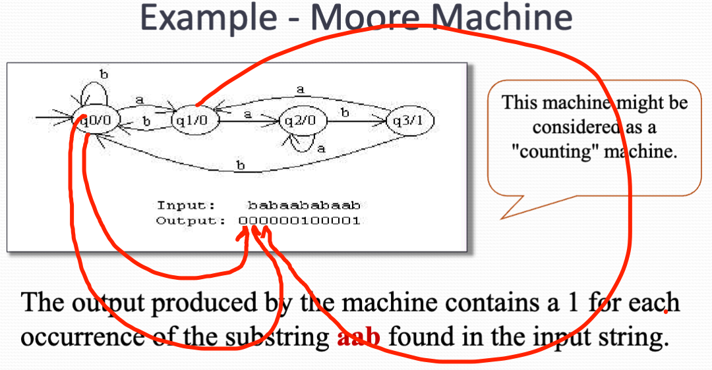
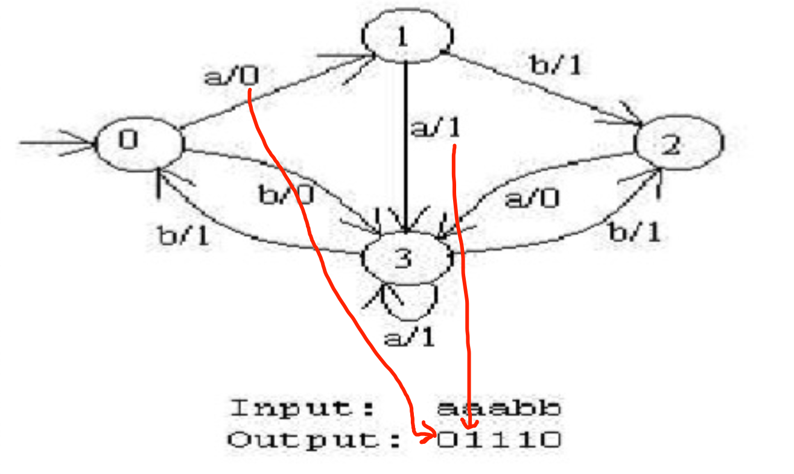
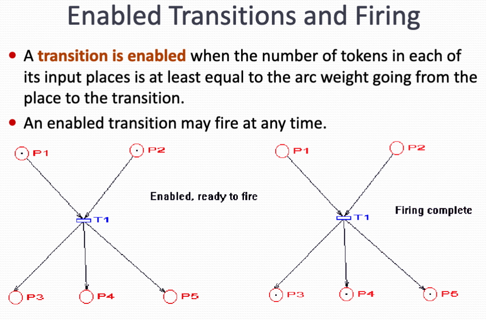
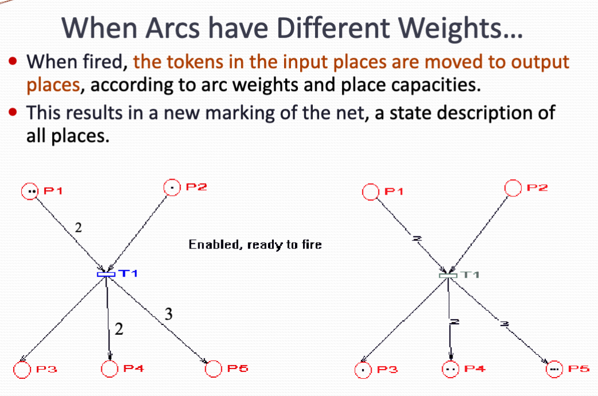
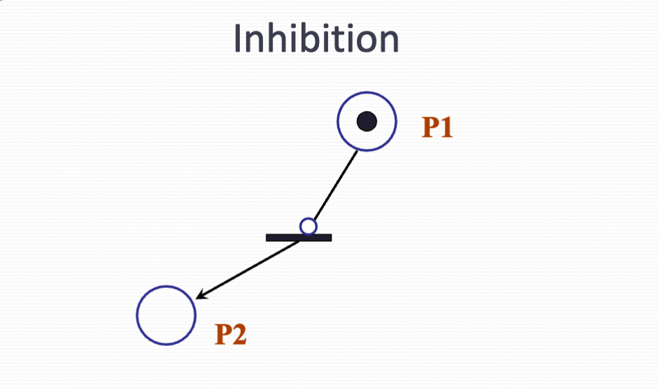
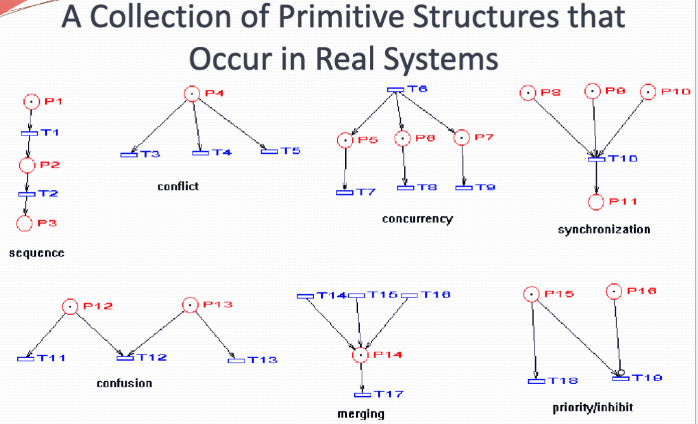
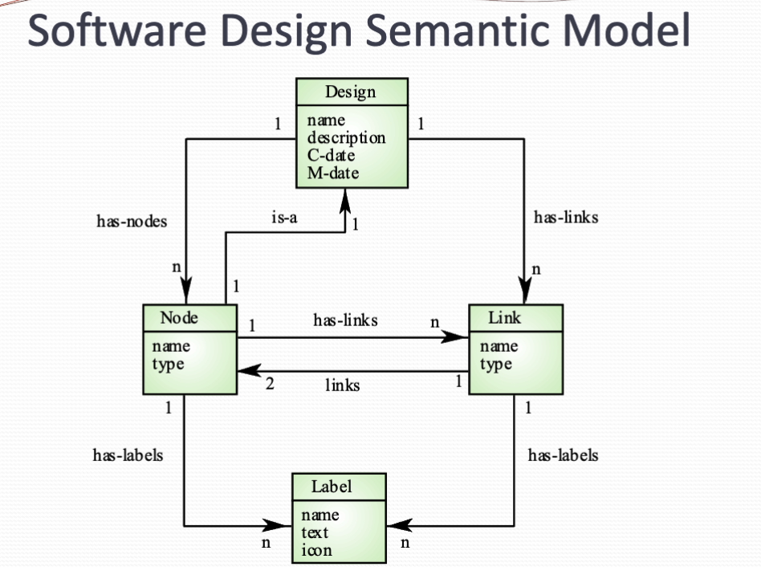
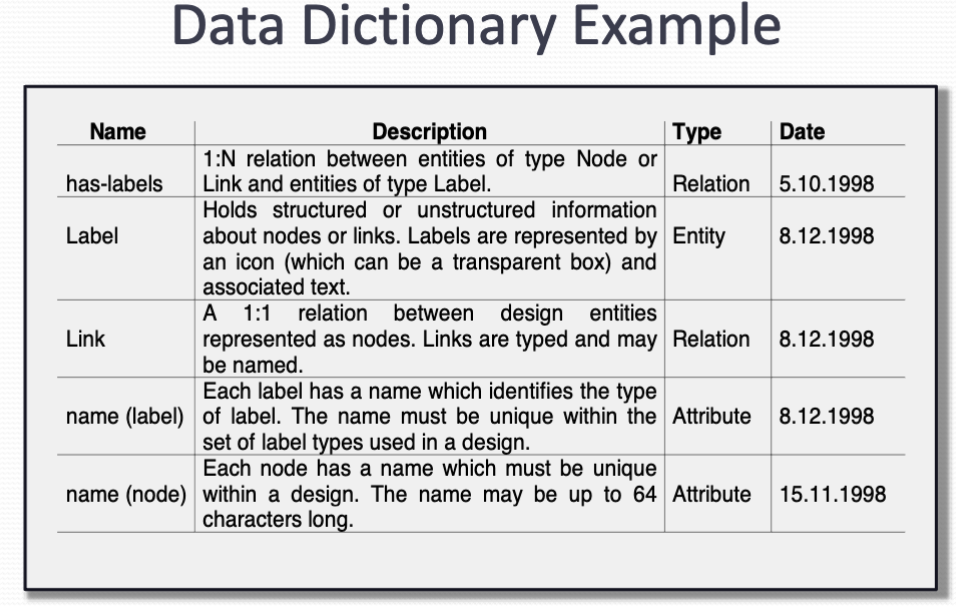
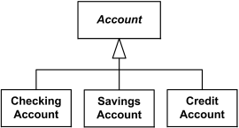

# System Model

## Finite state machines
Finite state machine is a model of computational system consisting of
- A set of state
- A start state
- Input alphabet
- Transition function that maps input symbols and current state to next state

**Note**

- State define behavior and the action of the system
- State transition a movement from one state to another
- Rules or conditions (in brackets) must be satisfied to allow a state transition
- Input event are either external or internal sourced, Which may possibly trigger a certain condition and lead to state transition

**Variant of FSM**

There are many variants  for example

- Machines having actions associated with transition (Mealy machine) or state (Moore machine)
- Multiple Start state
- Transition conditioned on no input symbol or more than one transition for a given  symbol and state (nondeterministic finite state machine)
- One or more states designated as acceptable states (recognizer) 

## Mealy and Moore machine
Mealy and Moormachine Our finite state machines with output.

Finite state automata are like computers in that they receive input and processed the input by changing states.

The owing output that we have seen finite state machines produce is "yes/no" or more than that.

## Moore Machine
A Moore machine is just a FSA with two extra attributes:

- It has two alphabet, an input and output
- It has an output letter associated with each state. The machine writes the appropriate letters as it reaches each state  
{width=700px}

## Mealy Machine

Mealy machines are computationally equivalent to more machines. We can implement any Mealy machine using the Moore machine and vice versa.

However, in Mealy machine, output is generate by labels on transition. This turn out to be easier to deal with in practice, Making a more practical.

*The output is in same length as input.* It is an output producer, not a language recognizer, so no accept states is in Mealy machine.

{width=700px}

## Petri Net

A petri net is a collection of directed edges connecting places and transitions.

Places may have tokens.

The state (or marketing) of a net (system) is it assignment of token in places.

*At any given the moment, several transition might be enable ready to file. Since more than one transaction may be eligible to fire there's no deterministic rule dictating which one must fire at first, The choice is often made arbitrary or based on some external criteria*

**Rule**

- Arc have capacity one by default
- Places have infinite capacity by default
- Transitions have no capacity
- Arcs can only Connect places to transitions or Transitions to places.

{width=700px}

{width=700px}

{width=700px}

{width=700px}

**Why use Petri NEt**

- Patron that are non-deterministic and that may be used to model discrete distributed system.
    - There may be several arcs which can fire and we do not know in which order this will happen.
- It's very general, Can be variated to more effectively model wider variety of systems.
-  says patron not have a rigorous and strict mathematical notation. Many crunches about system may be verified based at properties of Petri Net.

## Semantic Data Models

- Used to describe the logical structure of data processed by the system
- Entity-relation-attribute models
- Widely used in data design
- No specific notation provided in the UML, but object and association can be used

{width=700px}

**Data Dictionary Entities**

- A data dictionary as a list of all the names used in the system models
- Descriptions of the entities, relationships and attributes are also included

{width=700px}

## Object Models

Object models describe the system in terms of object classes.

It is an abstraction over a set of objects with common attribute and the services provided by each project.

- Natural ways of reflecting the real world Entities manipulated by the system
- More abstract entities are more difficult to model using this app across
- Object class identification is recognized as a difficult process requiring a deep understanding of the application domain
- Object classes reflecting domain entities are reusable across systems

**Categories**

- Inheritance models
- Aggregation models
- Interaction models

## UML - Unified Modeling Language

- Devised (designed) by the developers that widely used object oriented analysis and design method
- Has become effective standard for object oriented modelling
- There were many types of diagrams:
    -  use case diagram
    -   class diagram
    -    sequence diagram
    -     state chart diagram
    -      development diagram

**Note**

- Object classes are rectangles with name at the top, attribute in the middle section and operations in the bottom section
- Relations between objects are shown as lines
- Inheritance is referred to as generalization, which should be upward  
{width=700px}