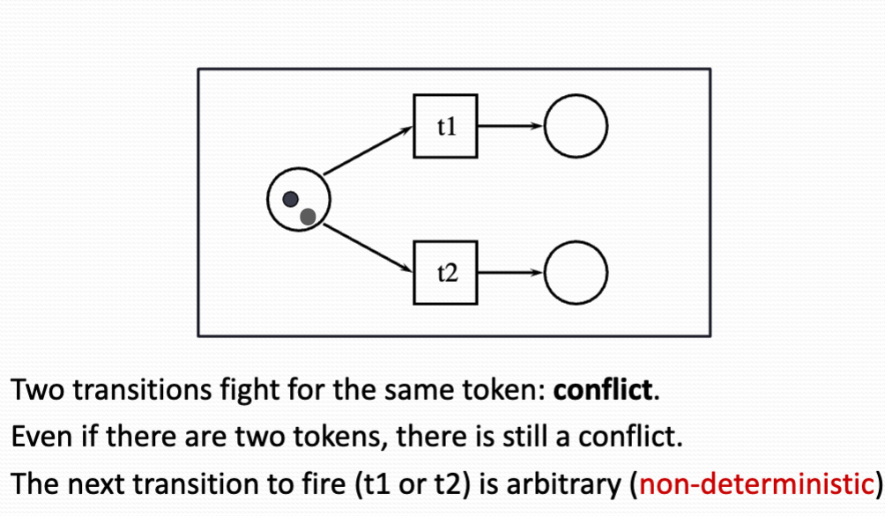

# Modelling Based on Petri Nets

## Why petri nets
- Petri Nets can be used to a rigorously defined system
- They are often used for distributed system (several sub system acting independently) and resource sharing systems
- Since there are many transitions in patron that activate at the same time, They are nondeterministic

## Classical Petri Net Model
- The state of a Petri Net is determined by distribution of tokens over the places
- A transition in Petri Net can have multiple input and output
- Enabling condition: A transaction is enabled if each of the input places contains tokens (more than required by weight)
- Firing: And enabled transition may fire, that consuming tokens from the input and producing tokens for the output places.
    -  Firing is atomic (only one transition fires at a time, Even if more than one is enabled)
- A transition without any input can fire at any time
- A transition without output will consume or delete the incoming tokens
- Conflict: Two transaction fight for the same token, Even if they were too token in the input place. Who will fire first is nondeterministic.  
{width=700px}

## Modelling
States of a process can be modelled by tokens in places, And transition leading from one state to another modelled by Petri Net transitions.

- Tokens can represent resources like human, goods, machines and information  or condition.
- Places represent buffers, channels, etc.
- Transition represent events, transformations or transportation.

## High-level petri nets
High-level petri nets are extended with
- Color
- Time
- Hierarchy