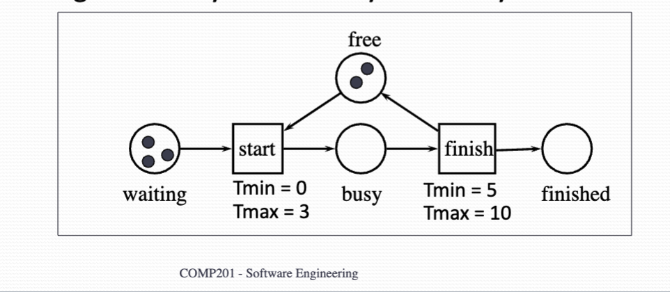

# Modelling with Petri Net

## Arcs in Petri Nets
The number of arcs (edges) Between two object specifies the number of token to be produced/consumed. Sometimes a number will be written to a single arc.

This can be used to model (dis)assembly process.

- Current state: The configuration of tokens over the places
- Reachable state: State reachable from the current state by firing a sequence of enable transitions
- Deadlock state: State where no transition is enabled

- Notation: (P1, P2, P3, P4, ...)  
- Example:  
{width=700px}

## High Level Petri Nets
Classical Petri nets have some modelling problems:

- Too large too complex. (you can have sub-nets)
- Takes too much time to model a given situation
- Not possible to handle time and data (i.e. Time constraints in traffic light)

Therefore, we have extended it with:

- Color: You can identify the tokens by the color. Therefore, color denotes the property associated with each token.
- Time
- Hierarchy

  

**Extension with Color**

Each transition has an formal or informal specification that specify:

- The number of tokens to be produced
- The value (property) of these tokens. i.e. the output token equals sum of two inputs
- Optionally, precondition. The 'if' statement for the output value.
{width=700px}

**Extension with Time**

In order to analyst performance, we must model the Duration And delay.

The value of time tells us the minimum and maximum time that a transition will take to fire after enabled.

This allows us to model performance property of the system.

{width=700px}

**Extension with Hierarchy**

A hierarchy is a mechanism to structure complex Petri Nets compared to data flow diagram.

A sub-Net is a net component, including sub places, sub transitions and other subnet.

This is the model of abstraction, Can reduce the capacity of the model.
