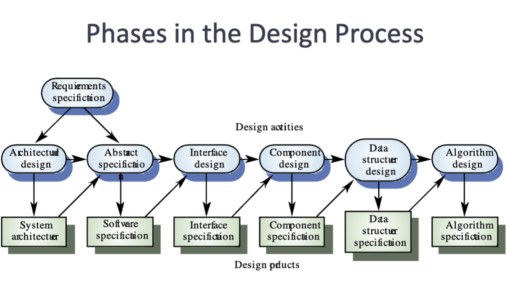

# Software Design

Software design is Deriving a solution which satisfy software requirement.

## Design Aspects
To break up the work, There are some principles:

- Each developer must not overlap or duplicate functionalities
- If one piece of cold writing to databases and another reading
    - They have to agree on database format, agreed to table names, the condom names and data type
    - One solution is using object database mapping software ORM (i.e. Hibernate)
- Interfaces between code should be decided as part of the design process
  - i.e. in Java you can use Interface classes

## Why Software Design

- Software needs to be
    - simple
    - understandable
    - flexible
    - portable
    - reusable
- Software Is produced by many people Collaborated.

**In reality**  
Design and implementation are interleaved.

## Stages of design
- Problem understanding
    -  looking at the problem from different angles to discover the design requirement
- Identify one or more solution
    -  evaluate possible solutions and choose the most appropriate depending on the designers experience and available resources
- Describe solution abstractions
    - Use graphical formal or other descriptive notation is to describe the components of the design
- Repeat process for each identified abstraction

{width=700px}

## Design Phases

- Architectural design: Determine subsystems
- Abstract specification: Specify subsystems. i.e. What they should do
- Interface design: Describe subsystem interfaces. i.e. using XML or JSON for web interfaces
- Component design: Decompose subsystems into components, Specifically, classes in OOP
- Data structure design
- Algorithm design

## Modular Programming

Computer systems are not Monolithic, They were usually composed of multiple, interactive modules.

### Modularity

Modularity has long been seen as a key, high-quality software

the goal of system design is to decode:

- What the modules are
- What the modules should do?
- How the modules interact with others.

In the early days, module programming usually refers to 'subroutines'.

But modularity cannot bring benefits and unless the modules are:

- Autonomous
- coherent
- robust

### Procedural abstraction
The most obvious design method involve functional decomposition.

This leads to programs in which procedures represents distinct **logical** function in a program. This is called procedure abstraction.

### Programs as functions
Another view is programs as mathematical function. That is you always have the same output if the input is the same (a mathematical mapping relation), no matter of the state of the system -- **referential transparency**. 

Good to utilize for *compilers*, not good for general purpose information systems.

Some programming language directly support this view of programming.

## Object oriented design
- The system is viewed as a collaboration of interacting objects.
- The system state is decentralized and each object manage its own state.
- Make use of internal state, which against philosophy of functional programming.
- Objects may be instances of an class and communicating by exchanging messages

## Criteria for design method
- Modular decomposability
    - The criterion satisfied if a method supports decomposition that the problem into small sub problems
    - A top down design method fulfill the criteria.
- Modular composability
    - The criterion is satisfied if a method leads to production of modules that may be recombined to produce **new systems**. (reusability)
- Modular understandability;
    - A design method satisfies this criteria if it encourages the development of modules which are easily understandable.
      - Can the component be understood on its own?
      - Are meaningful names given?
      - Is the design well documented?
      - Are complex algorithms used?
    - i.e. No ambiguous statement
- Modular continuity
    - A method to satisfy this criteria if it leads to the production of software such as a small changing in the problems specification lead to a small change in modules.
- Modular protection 
    - A method should yield system architecture that an abnormal at run-time effects as few modules as possible. 

**Top-Down Design**

In principle, top down design involve starting at the uppermost component in the hierarchy and working down the hierarchy level by level.

In practice, larger systems design is never truly top-down. Some branches are designed before others. Designers reuse experience during the design process.

**Repository models & Direct communication** 

Subsystems making up a system mastic exchange and share data so they can work together effectively

- Repository models: All share data is held in a database which may be accessed by all subsystems
    - advantages include
        - Databases are an efficient way to share large amount of data on a single data representation and data does not have to be transformed between different subsystems.
        - Subsystems producing data need not be concerned about how their data is used by other subsystems
        - Manage standard operations such as backup, security, access control, recovery and data integrity are centralized and become controlled by the single repository manager.
    - disadvantages:
        - Subsystems must agree on the data model which means compromises must be made, for in performers
        - Evolution may be difficult since a large amount of data is generated and translation may be difficult and expensive
        - Different systems have different requirements for security, Recovery and backup policies, which may be difficult to enforce in a single database.
        - It may be difficult to distribute the repository over a number of different machines.
- Direct communication: Each sub system and components maintain their own database. Data is then exchange between subsystems via message passing.