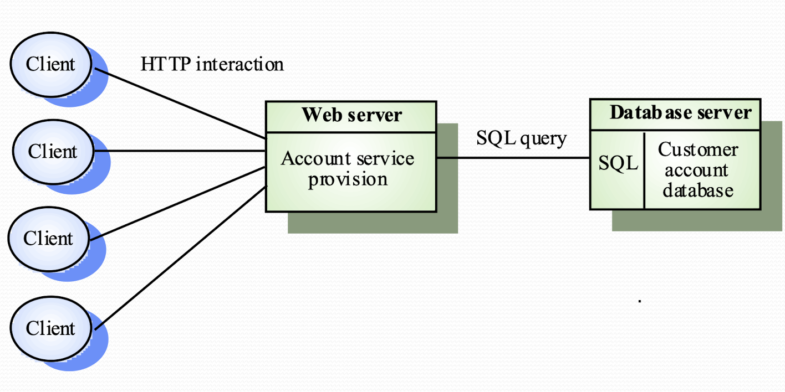

# Distributed System Architecture

## System Types
  - Personal System
  - Embedded System
  - Distributed System

## Distributed System Characteristics
  - Resource Sharing
  - Openness
  - Concurrency
  - Scalability
  - Faulty Tolerance
  - Transparency
  - disadvantages: complex, security, manageability, unpredictability

## Middleware
  - manage and supports different components of a distributed system
  - usually off-the-shelf  

## Distributed System Architectures 
  - Client-server: Services are called by clients, and server response to the request (sockets)
  - Distributed object architecture: each object can provide to others and use services from others (remote methods)

## Architectural Models
  - Multi-processor
    - Simplest distributed system model
    - System run task as processes at same time on different processor
    - NB, if there is one physical processor, the OS will slicing the runtime and dispatch to different processes.
  - Client-server 
    - Applications is modelled as a set of services
    - Client knows of servers and server doesn't know of clients
    - Client and server are logical problem. i.e. run a program listing to request repeatedly
    - processor on server can handle multiple processes. 
    - a physical clients terminal can have multiple clients. (sending request by ports)
  - Distributed object architecture
    - Each distributed entity is an object that provides and receives services to and from others
    - communication is done by Middleware
    - complex to design
    - pros: 
      - Service can be processed and computing on more than one node -- truly distributed
      - Can add more computing resources is needed
      - Flexible and Scalable
      - Dynamically configuration as the objects can migrating across the networks
  
## Layered Applications Architecture
A modern application usually has 3 layers

  - Presentation Layer. i.e. GUI
  - Applications processing Layer
  - Data layer. i.e. database

## Thin and Fat clients
  - Thin: server handles the application layer and data later
  - Fat: clients handle the application layer, server only send data
  - Nowadays, it is combined. Backend running some security applications, and front end like mobile apps run the thick processing or simply thin UI 

## Three-Tier architecture
  - Each layer runs on separate processor. i.e. on more than one server
  - suitable for large scale applications with thousands of clients
  

