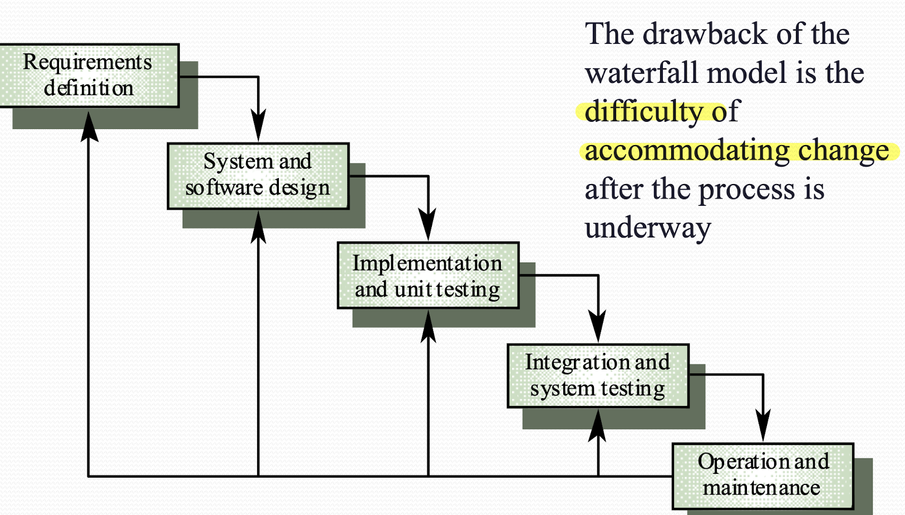
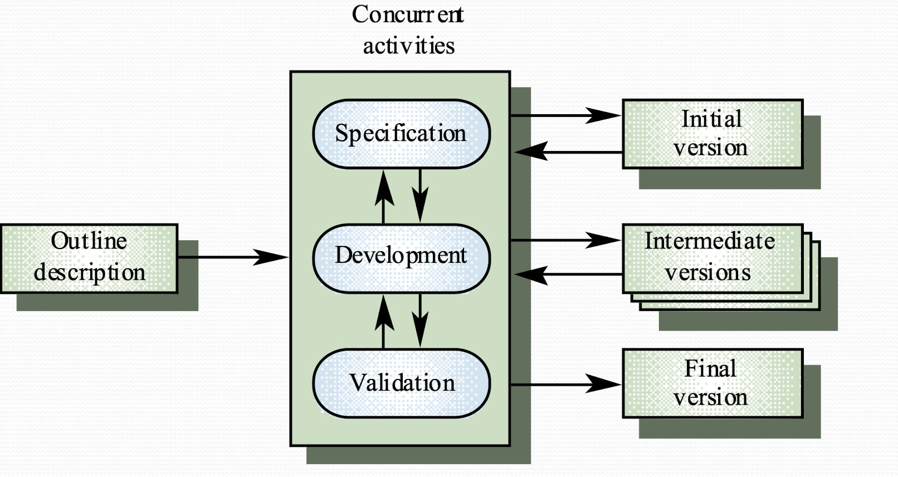

# Lecture 2 
## Software Process

## Software Process
- Life cycle: the process involves the building of a product. 
- For a software, its life cycle terminates when the provider stops support. 

## Software Process Model (Development Patter)

#### Waterfall Model
- A stepwise refinement of requirement.

- Suitable when the requirement is well-determined and understood.

- Drawback: 
    - inflexible partitioning of project
    - difficult to update

## Evolutionary Development
- Starting with a well-understood requirement
- Develop software form a initial implementation, then refine (add new features) it based on user's response.
- Evolutionary development involves Exploratory development

- Drawbacks:
    - Lack of process visibility
    - Sometimes poorly structured
    - Not suitable in safety critical projects

## Agile and Scrum
- Lightweight approach to software development
- Scrum: Incremental Development
    - Development and delivery is broken down into increments (*sprints*) that gives part of the functionality
    - High priority requirement are included in early increments