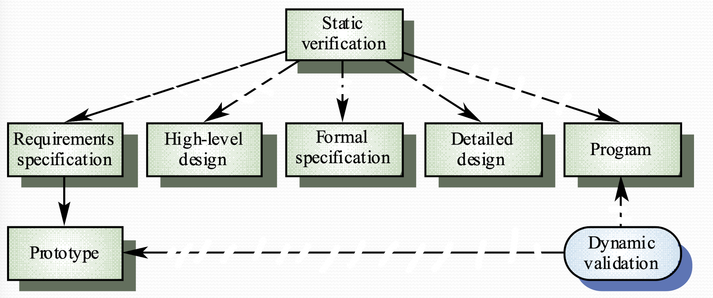
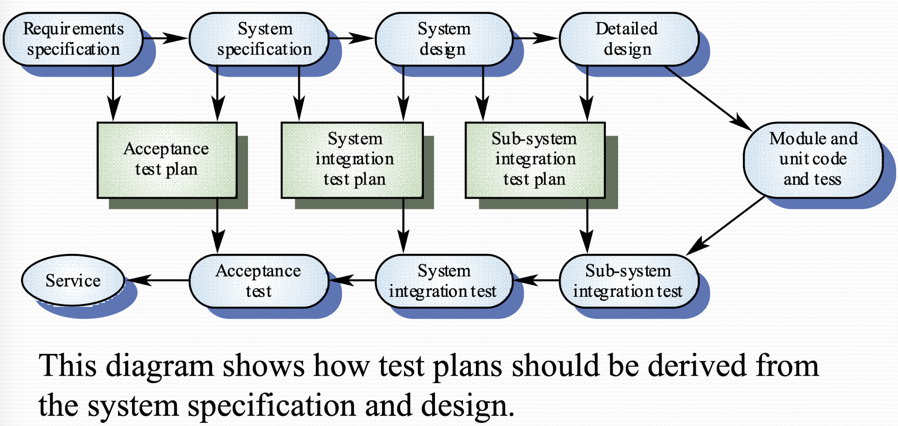

# Verification and Validation

## Verification & Validation
- Verification: "If the program meets specification documentation"

- Verification: "If the product meets user's expectation"

Validation > Verification

## In development process
V&V must be applied at each stage in software process
- To discovery defects in system
- To assess whether system is usable

## Static and Dynamic Verification
Software inspection (static verification): 

- Looks at the system and code representation to see any problem 
- supplement by tool-bases document and code analysis 
- i.e. Bad variable name, uninitialized value... 

Software testing (Dynamic verification): 

- Concerned with the behavior of system under dynamic operation 
- test by executing the system (test case) with test data to observe functional behavior 
- This is only possible when an executable version of program is available. Which is an advantage of incremental development since a testable version of the system is available at an early stage 
- Real data can be used as test input

## Program testing
- Testing can reveal errors' presences BUT CANNOT tell errors' not existence 
- A successful test can find one or more errors only once 
- Nonfunctional requirements can be validated only by program testing 
- Always used program testing with static verification to provide full V&V coverage

## Testing in Agile 
Agile development: 

- Agile Development is test-driven 
- Test cases are developed before coding 

Benefits: 

- Test could be created more validly, since it is based on specification purely 
- All code will be tested 
- Better suits specification

## Types of Testing

Defect testing:

- Tests are designed to discover system defects
- A good defect test could reveal the presences of defects in a system

Statistical testing:

- Test to reflect the frequency of user inputs
- Used for reliability estimation

## V&V Goal
"Verification and validation should establish a degree of confidence that the software is fit for purpose"

Could not ensure defect-free system

The degree of confidence expected is given by:
  
- Software function: How safety-critical the system should be 
- User expectation: Difference users require various level of fitness with specification
- Marketing environment: Cheaper products may have lower standard of faults 

## Testing and Debugging
Debugging:

- Debugging is concerned with locating and repairing errors 
- There is no simple process for debugging. It often involves looking for patterns in defective test output 
- i.e. Syntax error could be caught by compiler and it will indicate the location of error and the type of error. Semantic error may occur in a compiled program but produce incorrect output, they are harder to detect

Testing:

- Testing is for find the existence of defects
- Regression testing: it's advisable to retest the program with all test data after fixed one error to make sure you don't create new problems 

## V&V Planning
- careful planning as required to get the most out of testing and inspection process
- you should plan when and how to conduct test along the development process
- ideally,you don't want to submit your untested code to repository 

## Structure of the software test plan
- the testing process is a description of the major phase of the testing process
- requirement traceability: testing should ensure all the requirements are individually tested
- Tested item: what part of system or functions should be tested 
- testing schedule: an overall schedule for the testing of the software is required and resources must be allocated as part of the general project schedule
- Test recording: results of tests should be systematically recorded i 
- Hardware requirement: some test should be done on hardware maybe 

## Software inspection
Software inspection check everything from requirement, specification, UML diagram, coding, test data, etc.
- Involved people: programmer and another inspector
- Inspection is only'looking' for problems. So you can start inspecting before implementation phase 