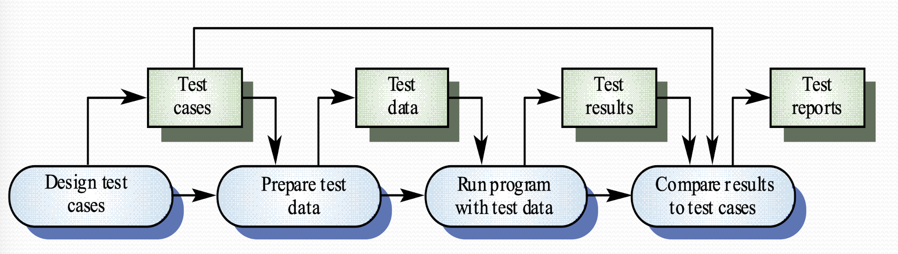
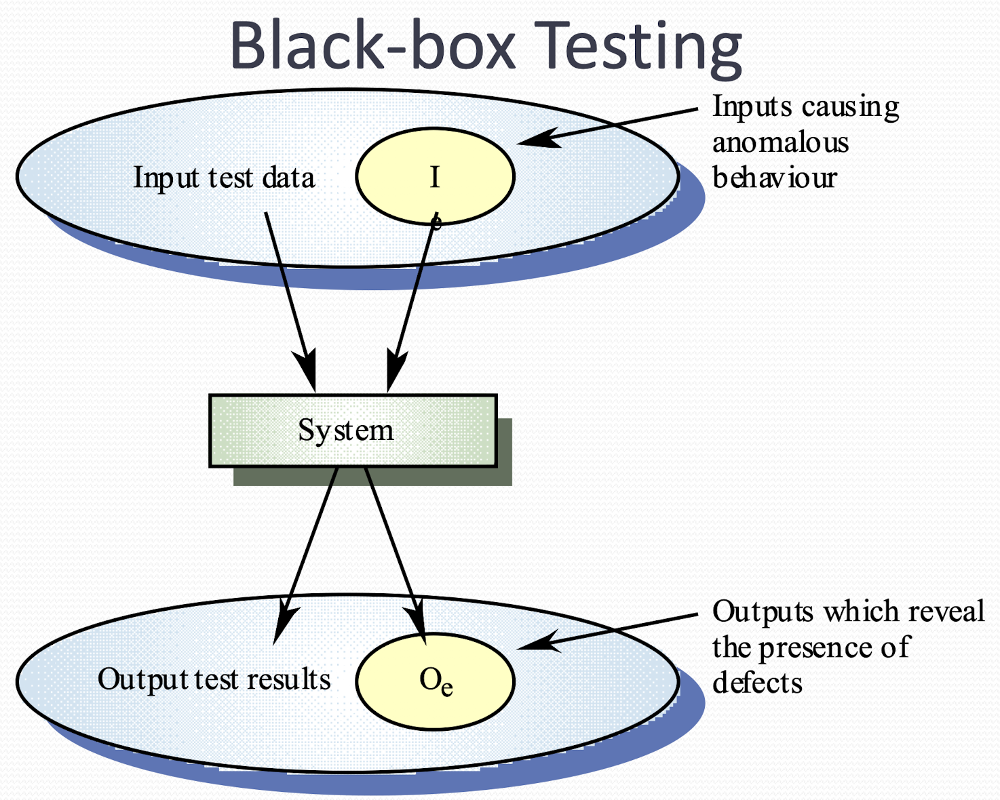
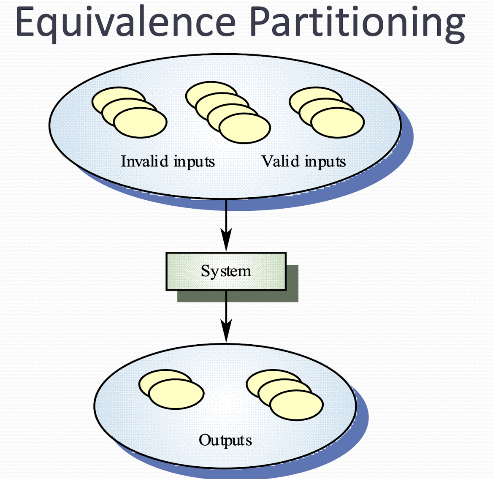
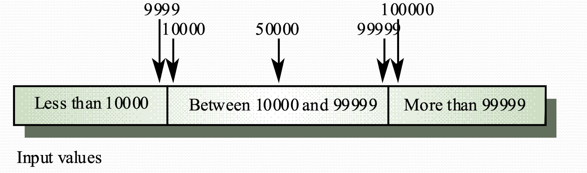

# Software Testing

## Testing Process
1. Component Testing
   - Developer in responsible
   - Test are derived from developers' experience

2. Integration Testing
   - Independent testing team in responsible
   - Test base on system specification

## Defect testing
- The goal of defect testing is to discover defects in programs, 
- a successful defect test is a test which causes the problem to behave in an anomalous way. 
- Tests only show the presence but not the absence of defect

## Testing priorities
- exhaustive testing is impossible
- test should exercise a system capabilities rather than components.
- Testing old capabilities (regression) is more important than testing new capabilities
- testing typical situations is more important than  boundary value cases

## Test data and test cases
- Test data: Inputs which have been devised to test the system
- Test case: input as well as the predicted output response of the system

## Black box testing
- A black box program is tested based on the system specification
- Test planning can begin early in the software process

## Equivalence partitioning

- Partition out of all test input that generates the same output is called equivalent partition
- So in order to cover all possible error, you should choose test data from different equivalent partitions
