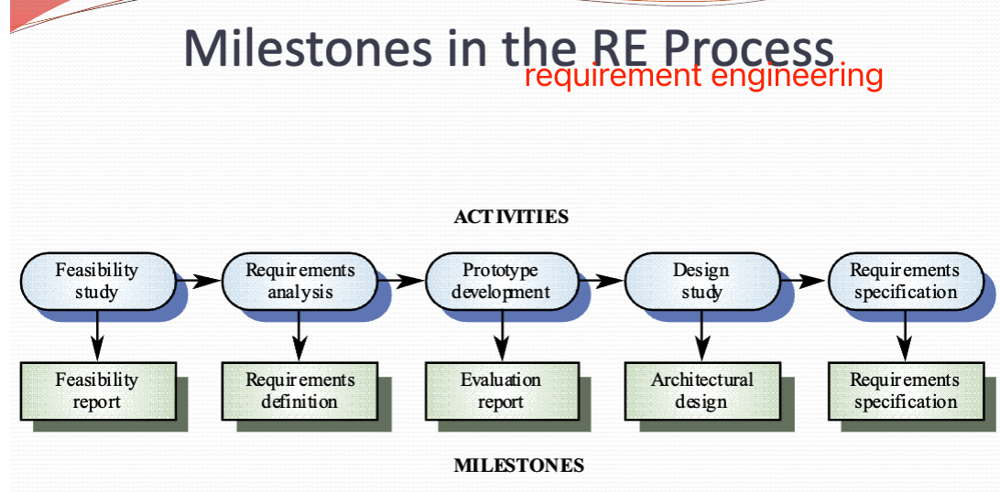
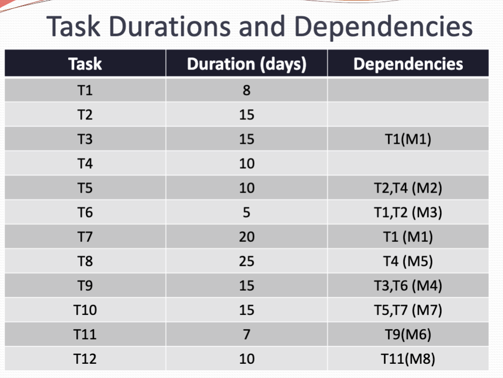
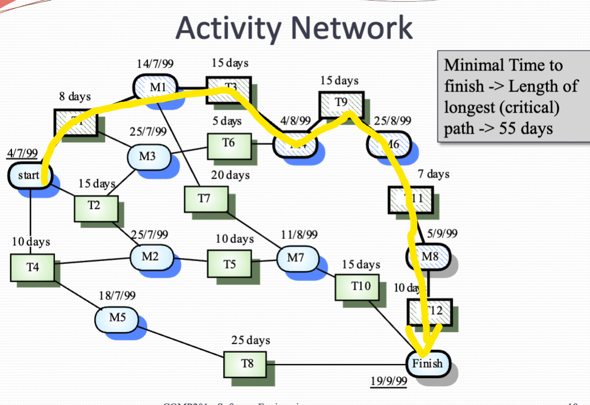
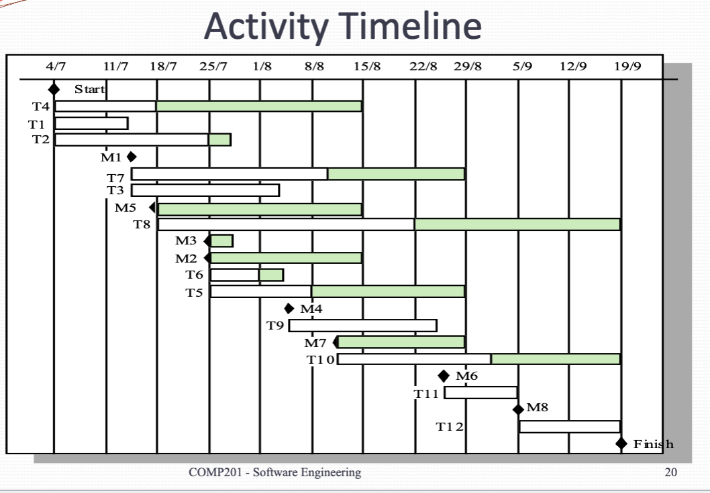
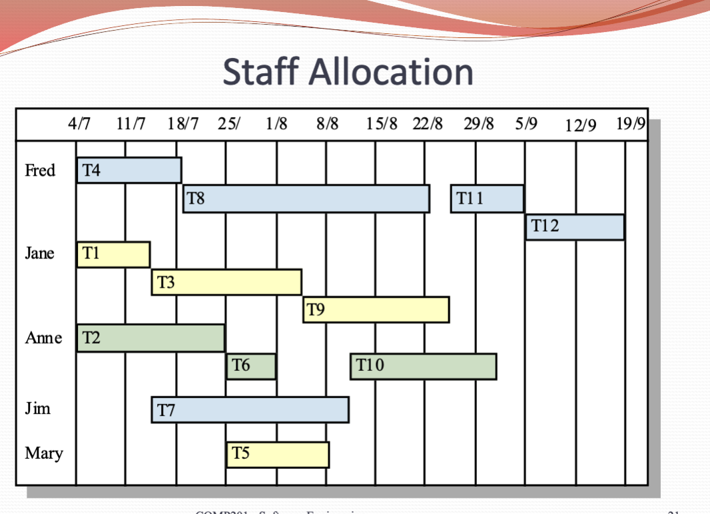
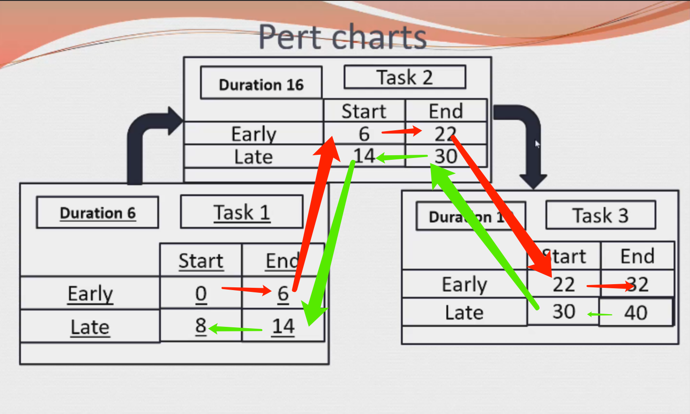

# Project Management
Organizing, planning and scheduling software project
## Software project management
Concerned with activities involved in ensuring that software is delivered on time and on schedule ending a quarters with the requirement of the organizations developing and procuring the software.

Project management is needed because software development is always subject to budget and schedule constraints that are set by the organization developing the software.

In terms of software, The product is intangible. Software engineering is not recognized as an engineering discipline with the same status as mechanical electrical engineering, et cetera.

Many software projects are one-off project

## Management activities
- Proposal writing.
-  Project planning and scheduling..
-   Project costing.
-    Project monitor and review reviews.
-     Personnel selection and evaluation.
-      Report writing and representation.
      

These activities are not particular to software management. Many techniques of engineering project management are equally applicable to software project management.

Technically, complex engineering systems tend to suffer from the same problems as software systems.

**Project Staffing**

May not be possible to appoint the ideal people to work on a project

- Project budget may not allow for the use of highly paid staff
- Staff with the appropriate experience may not be available..
- An organization may wish to develop employee skills on software project. 

Managers have to work within these constraints, especially when there is an international shortage of skilled IT staff

### Project planning

Probably the most time-consuming project management activities.

Continuous activities from initial concept through to system delivery. Plans must be regularly revised as new information becomes available.

There is different type of plan may be developed to support the main software project plan that is concerned with schedule on a budget.

- Quality plan: Describe the quality procedures and standard that will be used in a project.
- Validation plan: Describe the approach resources and schedule use for system validation.
- Configuration management plan: Describe the configuration management procedure and structure to be used. Not about code it self.
- Maintenance plan: Predict the maintenance requirement of the system, maintenance cost and the effort that needed.
-  Staff development plan: describe how the skills and experience of the project team members will be developed.

A project plan structure:

- Introduction.
-  Project organization.
-   Risk analysis.
-    Hardware and software resource requirement.
-     Work breakdown.
-      Project schedule.
-       Monitor and reporting mechanism.
-       

### Activity organization

- Activities in a project should be organized to produce tangible for management to judge process.
-  Milestones at the end point of the process activity.
-   Deliverable a project result deliver to customers.
-    The waterfall process allows for the straightforward definition of progress milestones.

{width=700px}

### Project scheduling

- split project into tasks and estimate time and resources required to complete each task.
- Or tasks concurrently to make optimal use of workforce.
-  Minimist task dependencies to avoid delays.
-    Dependent on project managers intuition and experiences.
-    

**Scheduling problems:**

- Estimate the difficulty of problems and hence the cost of developing a solution is hard
- Productivity is not proportional to the number of people working on a task.
-  Adding people to a late project can make it even harder because of communication overhead.
-   The expected always happened. always allow for contingency in planning.

**Bar charts and Activity Networks**

Graphic connotations can be used to illustrate that project schedule

 Show project breakdown into tasks. Tasks should not be too small, most of them should be taken about a week or two.

  Activity chart shows task dependencies at the critical path.

   Bar chart shows schedule against calendar time.

{width=700px}

{width=700px}

{width=700px}

{width=700px}

**Pert Chart**

Tool for analyzing the schedule, including:

- Dependencies
- early start
    - Earliest time the task can start (Given its dependencies in best case)
- early end
    - Early start time plus estimated task time
- last start
    - Latest time the task can start without delaying the deadline (Consider there may be Tasks depend on this Task)
- last end
- Slack
    - Amount of tasks can be delayed without delaying the project
    - Slack = 0 is critical

{width=700px}

### Risk management

Risk management is concerned with identifying risks and drawing up plans to minimist their effect on the project.

- Project risks affect schedule or resources
- Product risks affect the quality of the performance of the software been development
- Business risks affect the organization developing or procuring the software.

**Risk management process:**

- Risk identification
- risk analysis
    -  assess the likelihood (probability) and consequence (seriousness) of the risks
    - i.e. Company financial problem for 极越汽车 is high probability and catastrophic seriousness
- risk planning
    -  drawn up plans to avoid or minimist the effect of the risks
    -  You should have Avoidance strategy, 
    -  Minimization strategy (pre design the project so that minimize the effect), 
    -  Contingency plans (if the risk rises, Contingency plans are plans to deal with that risk)
- risk monitoring
    -  Monitor the risks throughout the project

**Types**

- Technology: The database cannot handle too much transactions
-  People: It is impossible to recruit staff With the skills required perfectly
-  Organizational: The organisation is structured so that different management are responsible for the project. Or the company is in financial problem
-  Tool: Some tools cannot be integrated, Or not efficient enough
-   requirement: Changes to requirement which require A lot of design rework.
-    Estimation: The time required to divide the software is under estimated
    
