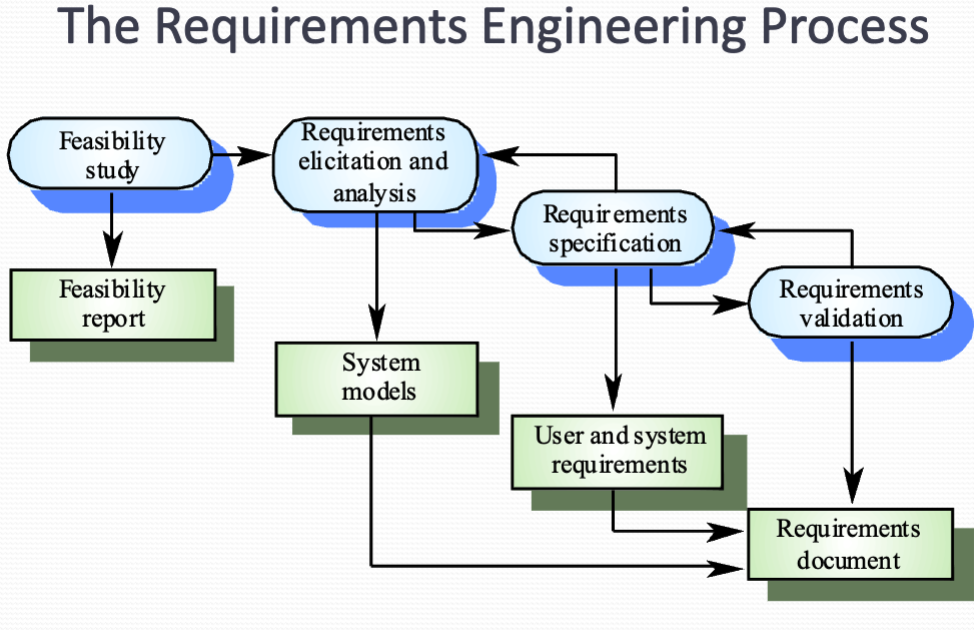
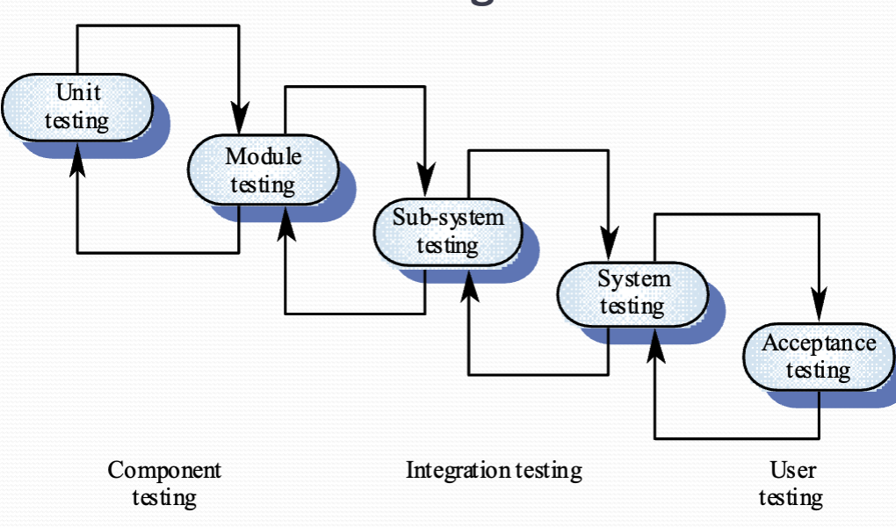

# Lecture 3 Software Process

- requirement engineering and specification
- software design
- programming testing and debugging
- software evolution

## software specification
- specification is the process of establishing what are required and the constrains of the systems operation and development
- it may contains:
    - ==Feasibility study==
    - Requirement elicitation(发掘) and analysis
    - Requirement specification
    - Requirement validation

{width=700px}

## software design and implementation
It is the process of converting the system specification into an executable system

- Software design  
    - Design a software structure they Realise the specification
    - Design the database website data structure, communication protocols
- Software implementation
    - Translate this designs into an executable program
- N.B. The activities of desire implementation are ==closely related and may be interleaved==

### design process activities
- Architectural design
    - Design the subsystems that makes up the system and their relationships, Well represented by Documentations.
- Abstract specifications
    - For each subsystems, design and specifies the operational constrains and services
- Interface design
    - For each subsystem, clear interface with other other subsystems is designed and well documented
- Component design
    - Allocate services to components, As well as design the interfaces
- Data structure design
- Algorithm Design

**Two design philosophy**
- Data driven design
    - Always start by looking at the data that The system will process
- Responsibility driven design
    - Think of the functions at first (the responsibility of the system)
    - break complex functions into smaller function parts
    - each responsibilities may require Some data to support the action

**Design methods**
- The design is usually documented as a set of graphical models
    - Data-flow model
    - Entity-relation-attribute
    - Structural model
    - Object model
    - State transition model

## Programming and Debugging
- Programming and debugging process is translating a design into a program and remove Error from the program
- programming is usually a personal activity
- programmers carry out some program testing to discover faults in the program and debug in the debugging process

**Good programming is iterative**

## Testing stage

{width=700px}

- Unit testing is for individual components. i.e. Test class methods
- Module testing is for a collection of Dependent components. i.e. Test classes that are integrated with others
- Subsystems are integrated by modules, the testing focus on the interfaces of subsystems. i.e. Test a number of classes what collaborate to provide a service, often organized by JAR libs
- System testing
- Acceptance testing is for test if the system is acceptable to customer data

