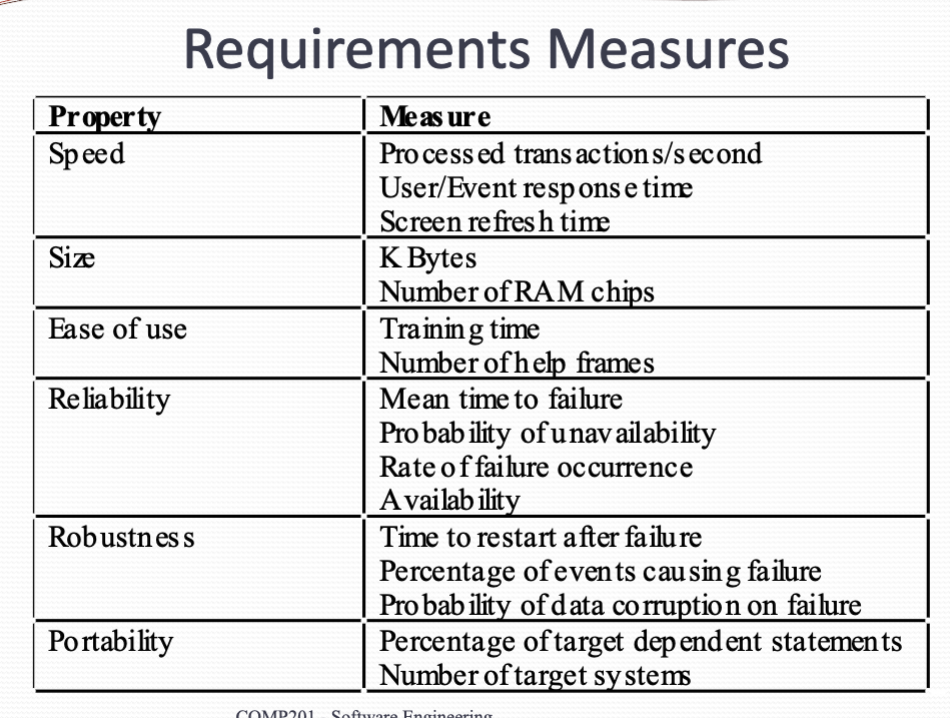

# Software Requirement

## Requirement engineering
requirement engineering is the process of establishing

- What is the services that the system should provide?
-  The constraint under which the system operates and is developed.

Why do we need requirements?

- Fully understand the problem that need to be solved
- discover why the problem needs to be solved
- Determine who should be involved
- Poorly defined requirements can cause major problems to the projecting both financially and in terms of time

## What is requirement?
- Requirement May be high-level abstraction statement for services or system constraint
    - Since the specification may be the basis for biding a contract, and should be open to interpretation and update. So it should be high-level and general
- Requirement may be detailed mathematical functional specification
    - Both two statements may be called requirement
- Requirement can be refined iteratively

- Specification focus on **services** provided
- Generally Focus of interface and behavior,  instead of what language in programming
- Specification should be detailed enough to act as a base for testing

## Types of requirements

### Levels
- User requirements. You're really natural language and diagrams of services, Sometimes provide the operational constraints. Written for customers to interpretation.
- System requirements. Structure document setting out detail description of the system services. Written as a contract between client and contractor.
- Software specification, Describe the software design or implementation. Written for developers
    - i.e. NLP texts should be defined in UNICODE string. Using hash table to import code efficiency...

### Functional and non-functional
- Functional requirement is The statement of services that the system should provide, How the system should react to some impact, And what should be behave in particular situation
- Non-functional requirement is the constraints on the services or Functions. i.e. Timing, Specific development process, Standards
    - Define system properties And constraints. i.e. Reliability, Response time, Storage requirement.
    - Process requirement may also be malfunctioning requirements. i.e. The programming language or development method
    - Sometimes no functional requirements may be more critical than functional requirements
- Domain requirement
    - It can be functional or non-functional
    - Requirement related to the application domain. i.e. Medical Institution, Banks
    - Programmers do not often understand Legislative constraints, Therefore, specialist should make the requirement to follow the law

**Non-functional requirements classification**

- Product requirement.i.e. Execution speed, reliability
- Organizational requirements. i.e. Coding style, implementation requirements
- External requirements. i.e. Legislative requirements

**Goals or Non-functional requirements**  

Non-functional requirements are difficult to state Precisely and difficult to verify.

Yet some can be objectively tested, **and you should always make it testable**.

The **goals** as to convey the intention of users to the Developers

**Conflict between non-functional requirements are common**

i.e. *Password should be easy to use* &  
*Passwords should have upper/lower case and special symbols*

## Requirement Imprecision
Problems arise when requirements are not precisely stated.

## Requirement completeness and consistency
- Complete means requirements should include descriptions for ll facilities
- Consistent means requirements should be no conflicts or contradiction in the descriptions of system facilities

## Requirement measures
{width=700px}