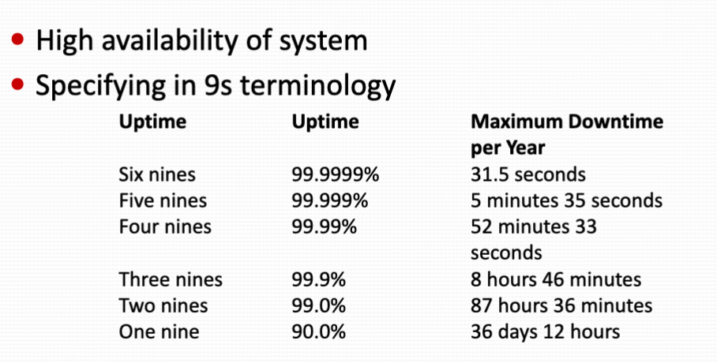
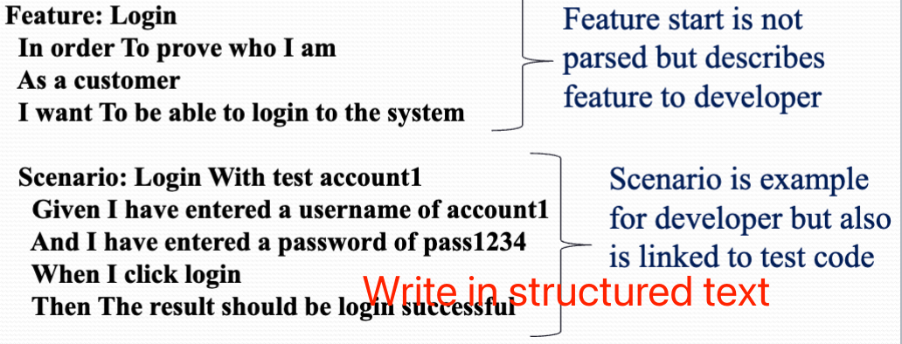
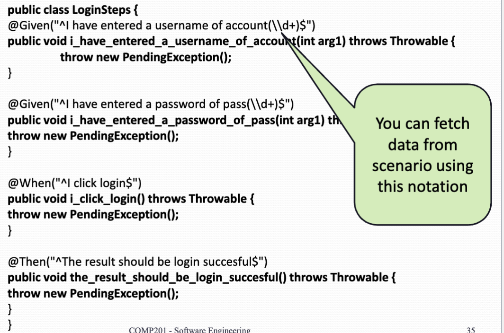

# Requirement engineering process

### Security requirements
**Availability requirement**

{width=700px}

9s Terminology not always useful. You may want more than time to describe the availability.

Think about three 9s: 78 seconds unavailable per day

Ideally you need to specify:

- Worst case scenario
- Worst case delay as well as Downtime
- How the system can Degrade gracefully (i.e. shutdown with data saved)

**Logs and alerts**

Security depend heavily how the maintain know of activities. Audits and logs help.

- Standard log
- Failed login log
- Unusual activity log
- Alert log

**Bell-LaPadula model**

All items are given a security clearance level

- Top secret, Secret, sensitive, unclassified

**Rules:**

- No read up:
    - A subject cannot read the document above their clearance level.
- No write down:
    - A document cannot be copied/included in another document that in a lower security clearance.
    - So if I want to add a top-secret term to a "sensitive" Document, The result will be a top-secret document
- Only trusted subjects can write document down
    - The subject should be shown really trust worth Regarding to the security policy.

**Security Specifying**

- Ideally, security requirement should be kept as open as possible to allow further upgrading if encryption algorithm or protocols

**Security policy**

Make requirement for people to follow.

- Shredding documents after reading
- Security disposal of USB device

## Requirement Checking

- Validity: does the system provide the functions which support the customers need?
- Consistency: Are there any requirement conflicts?
- Completeness: Are all functions included?
- Realism: Can the requirement be implemented whether they given available budget and technology?
- Variability: can the requirement be checked?

**Test cases within Scenarios**

- Show the developer by examples, what will happen given certain condition.
- They can be used to create testing for the software
- Scenario test making things very clear and reduce ambiguity

**Agile Requirement Tool**

- Cucumber: A user story tool
    - It's a software tool used to help writ requirements which are linked directly to tests
    - Cucumber uses a text format Gherkin which describe features and test data, can be integrated with JUnit  
    {width=700}
    {width=700}

- Gives simple and clear notation to write specification
- Analysts/test team and even customers can learn Gherkin and develop feature files
- Step files are produced by development team
- Test data can be change easily