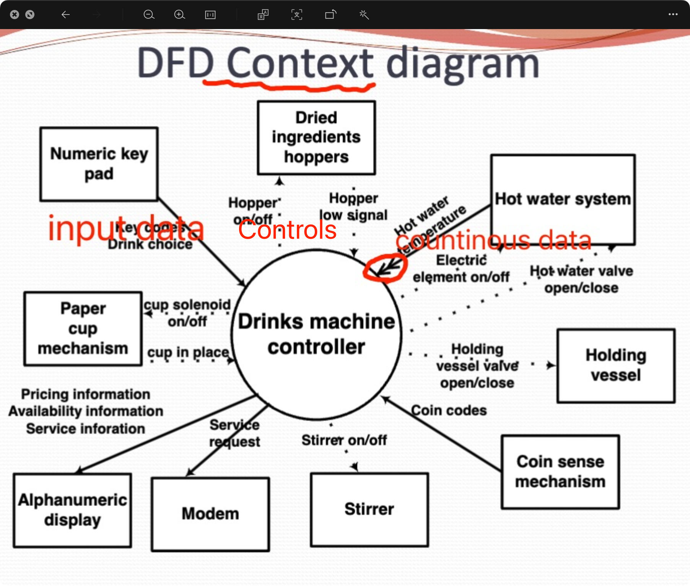
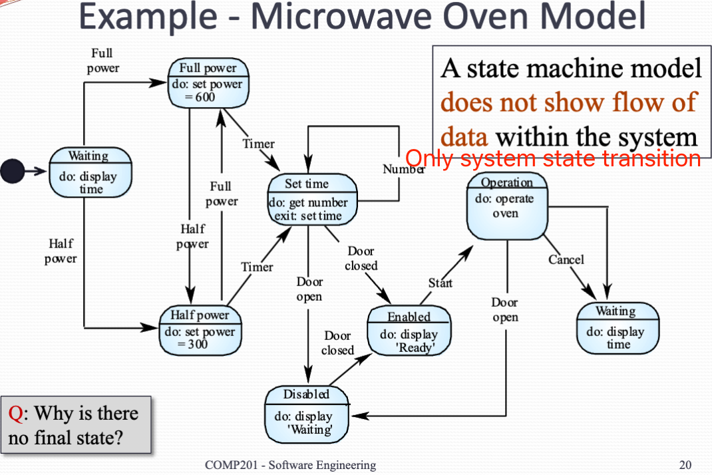
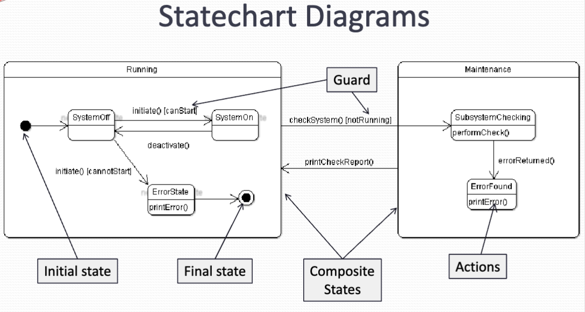

# System models

## System modelling
Use our requirements must be written in such a way that non-technical experts can understand them (natural language)。

However, some detailed system requirement may be expressed in a more technique way. One of the most widely used technique is to document the system specification by system models.

System model is a graphical representation that described business process and the system.

System modelling helps the Analyst to understand the functionality of the system and models are used to communicate with customers

Different models Present the system from **different perspective**

- External perspective
- Behavioral perspective
- Structural perspective: Show the architecture of system or data

**System Model Advantages**

- They can be easier to understand using a Verbose natural language description
- Can leave out unnecessary details of the system, Therefore, focus on what is important
- Different models can focus on different approaches to abstraction

**Weakness**

- System model do not show non-functional requirement
- They don't include information about whether a methods is appropriate for a given problem
- May produce too much documentation
- System models are sometimes too detailed and difficult for users to understand

## Model Types
- Data processing model: Show how data is processed under different stages
- Composition model: Show how entities are composed with the others
- Architectural model: Show subsystems
- Classification model: Show how many have common characteristics. i.e. class diagram
- Stimulus/response model: Show how the system React to event
- Context model: Used to illustrate the boundaries of the system
    - The boundary depends on social and organizational concern
    - The architecture of the system

### Behavioral model

Two types of behavioral model to describe the overall behavior of a system. Both of them are required for a description of the systems behavior

- **Data processing model**
    - i.e. Data flow diagram
    - Date of floor diagram track and document how the data associated with the process. It can also show how the data exchange between the system and others.
    - Developing a deep flow diagram is usually a top-down process
    - DFD shows a func tional perspective, instead of data perspective (that shows how data is represented and structured). It show how data is manipulated.  
    {width=700px}
- **State machine model**
    - State chart diagram or State machine models Shows the behaviour of the system in response to external and internal events
    - Often used in real time system
    - State chart are an integral part of UML  
    {width=700px}
    - Stay hard also allow the decomposition of the model into sub models.  
    Can be complemented by tables describing the states and the stimuli  
    {width=700px}
        - The label on an arc denote the event (or the function method)
        - A guard is used to ensure system move only if expression is satisfied (condition)
        - A state can have a composite state in it (sub diagram)
    - Tips:
        - Always have one idle state where the process is not active
        - All states need some exit (no deadlock)
        - Use multiple stage charts to keep one design simple
        -  system can be described by multiple state machine running concurrently

**Finite State Machine**

A finite state machine is a model of computation consisting of

- A set of state
- A start state
- Input alphabet
- A transaction function that maps *input symbols* and *current state* into a next state