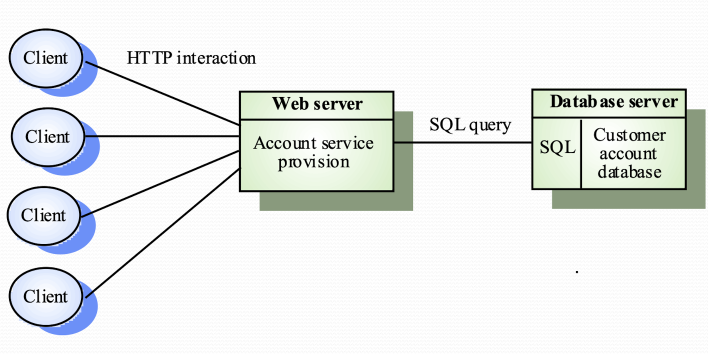
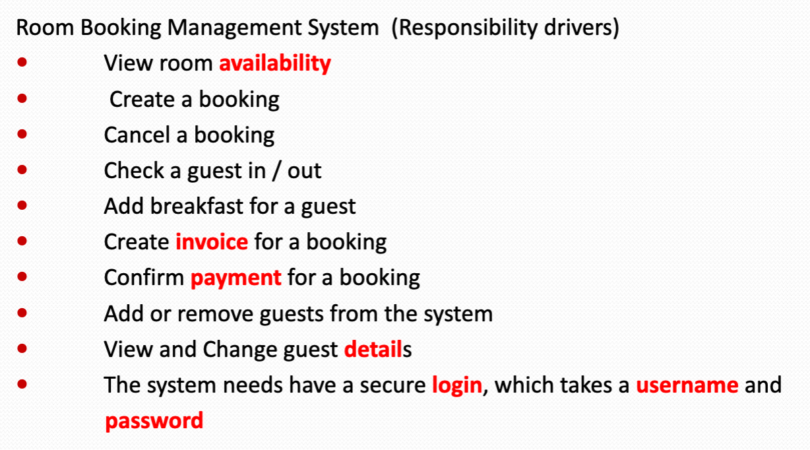
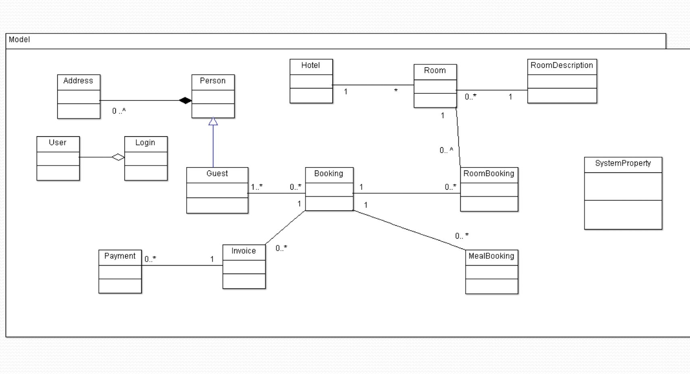
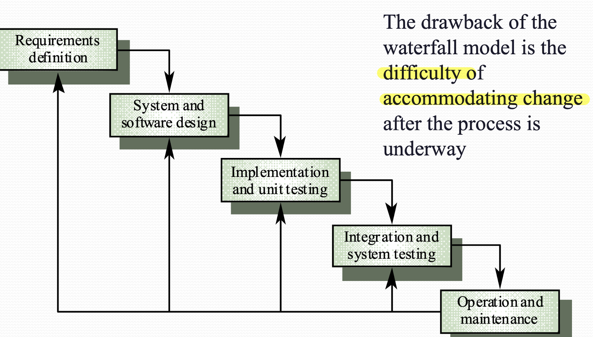
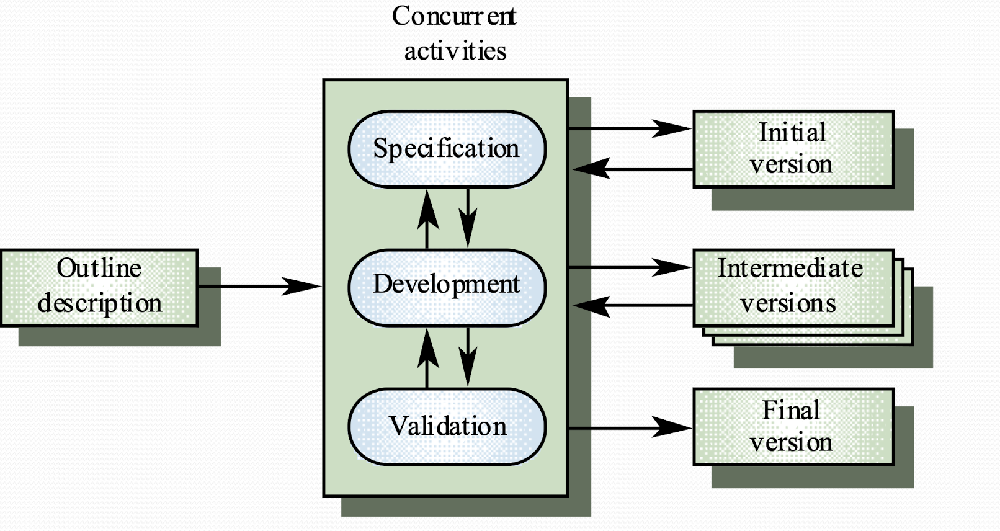

# Lecture Note


## Lecture 14 Design Methodology
### Software Deign
  - the design process is to derive a software solution that satisfy requirements. 

### What is a good system
  - Useful and usable
  - Reliable (low coupling)
  - Flexible (low coupled, high cohesion)
  - Affordable (Reusability)
  - Available (dev cost optimized by reusing)

### Module Interface
  - abstraction
  - encapsulation: others cannot know the internal info unless interface allows
  - change of internal state of a module doesn't affect other part of the system

### Principles for good design
  - Linguistic Modular Unit
    - i.e. Java classes. BASIC language is not Linguistic
  - Few interfaces
    - Module communicate with as few others as possible. i.e. facade structure
  - Small interfaces
    - The interface should concise, aka Loose coupling. Messaging between modules should be minimum
    - The receiver does not change data of sender. i.e. using immutable data (string, ~~array,ptr,etc~~)
  - Explicit interfaces
    - The interface and document should be clear. i.e. Who is communicating with who
  - Information hiding
    - Make everything private

### Coupling
  - loose coupling means changes in a components not affect other components
  - bad practice is 'shared variables/control event'
  - good practice is 'decentralization / store states inside objects instead of shared repo'
  - OOP is loosely coupled. Because no shared state and communication achieved by message passing. However, each object always coupled with its super-class

### Cohesion
  - each components only handle one problem logically
  - Inheriting attributes from super-class weakens cohesion
  - various levels:
    - coincidental Cohesion
    - logical association
    - temporal Cohesion
    - communication Cohesion
    - sequential Cohesion
    - functional Cohesion
    - object cohesion
  - cohesion & encapsulation:
    - cohesion: how good the functionality of module is organized logically
    - encapsulation: how good the data and methods are protected

### Reusability
  - Reusability ensures low cost of software

### Stepwise Refinement
  - Top-down split problems
  - Recursively refine
  - Until problem can be solved in 7-lines for example

### Good Practice: High Cohesion, Loose Coupling with good interface
  - If so, the module is easy to reuse or even pluggable


## Lecture 15 Distributed System Architectures

### Software Architectures
  - Architectural Design: 
    - The early stage of design process, generate description of architecture
    - Focuses on sub-systems (System components) and their communication & control
    - In parallel with other specification design
  
### Architectural Design process
  - System structuring: decompose systems into components and identify the communication
  - Control modelling: determine the model of control relationship between components
  - Modular decomposition: decompose sub-systems into modules

### Sub-systems and Modules
  - Sub-system: operation independently, separately. i.e. JAVA packages, login system
  - Modules: in a sub-system, but work together.  

### Benefit of subsystem modelling
  - Re-assemble subsystem to build new system

### Architectural Models
  - Different models may be produce during the design process
  - Different perspective gives different Architectures
    - Static structural: merely show the components
    - Dynamic process: who is calling how
    - Interface model: define sub-system Interface
    - relationship model: data-flow model

### System structuring
  - decompose the system into interacting components (sub-systems)
  - use Block Diagram

### Repository Models: data exchange between subsystem
  - central database: suitable for large data
  - internal database: each components pass data to each other

### Client-Server Architecture
  - components
    - servers
    - clients: call on services
    - networks
  - Feature
    - distribution of data
    - effective use of networks
    - easy to extend new servers or upgrade
    - No shared data, data interchange inefficient
    - Redundant management in servers
    - Hard to parse server and services

### Control model
  - centralized control
    - one of subsystems control others
    - call-return model
      - top-down subroutines, using in sequential system
      - NB, in a sequential model, events are also handled parallel in background in higher level
    - manager model
      - concurrent system, control subsystems in parallel
      - real-time system control
  - event-based control: server's handler listening for events then response accordingly 
    - broadcast model
      - integrating different subsystem to response and working together
      - control message is not embedded in event
      - system not know when event happens
      - NB, most of time is idle
      - i.e broadcast -> {LED1, LED2, LED3, LED4}
    - interrupt-driven model
      - NB, most of time is busy
      - used in real time system, fast response
      - there is a handler in each interrupt types. i.e. INTERRUPT A -> LED1, INTERRUPT B -> LED2 

### Modular decomposition
  - object model
    - loosely coupled objects and well-define interfaces
    - include: classes, attribute, operations
  - data-flow model
    - defines the batch sequential pipeline, used in data processing system
    - not suitable for interactive system


## Lecture 16 Distributed System Architecture

### System Types
  - Personal System
  - Embedded System
  - Distributed System

### Distributed System Characteristics
  - Resource Sharing
  - Openness
  - Concurrency
  - Scalability
  - Faulty Tolerance
  - Transparency
  - disadvantages: complex, security, manageability, unpredictability

### Middleware
  - manage and supports different components of a distributed system
  - usually off-the-shelf  

### Distributed System Architectures 
  - Client-server: Services are called by clients, and server response to the request (sockets)
  - Distributed object architecture: each object can provide to others and use services from others (remote methods)

### Architectural Models
  - Multi-processor
    - Simplest distributed system model
    - System run task as processes at same time on different processor
    - NB, if there is one physical processor, the OS will slicing the runtime and dispatch to different processes.
  - Client-server 
    - Applications is modelled as a set of services
    - Client knows of servers and server doesn't know of clients
    - Client and server are logical problem. i.e. run a program listing to request repeatedly
    - processor on server can handle multiple processes. 
    - a physical clients terminal can have multiple clients. (sending request by ports)
  - Distributed object architecture
    - Each distributed entity is an object that provides and receives services to and from others
    - communication is done by Middleware
    - complex to design
    - pros: 
      - Service can be processed and computing on more than one node -- truly distributed
      - Can add more computing resources is needed
      - Flexible and Scalable
      - Dynamically configuration as the objects can migrating across the networks
  
### Layered Applications Architecture
  - Presentation Layer
  - Applications processing Layer
  - data layer

### Thin and Fat clients
  - Thin: server handles the application layer and data later
  - Fat: clients handle the application layer, server only send data
  - Nowadays, it is combined. Backend running some security applications, and front end like mobile apps run the thick processing or simply thin UI 

### Three-Tier architecture
  - Each layer runs on separate processor. i.e. on more than one server
  - suitable for large scale applications with thousands of clients
  


## Lecture 17 OOP
### Object Oriented
  - object incorporate both data structure and behavior
  - System functionality is expressed in terms of object services 

### Object
  - behavior + state + identity
    - state
      - state of an object is all the data that it encapsulated
      - objects has a number of attributes
      - some attributes are mutable (address, reference) at the immutable
    - behavior
      - an object can understand certain messages, the messages is normally fixed like the set of attribute it has 
    - identity 
      -objects are not defined just by the current value of their attributes
      - the state of an object may change but is still the same object logically 

  - Firstly, don't think water and object will have, instead think what will it do for the system
  - objects are potentially reusable components
  - An object is the thing you can interact with, i.e. You can send your request and get reaction.
  - NB: How object behave may change as the current internal state of the object varies
  - pros: no centralized data, only communicate by messaging. Independent encapsulated easy for maintenance

### message
  - a message includes a selector, i.e. the method that returns the message. 
  - A message may have arguments 

### interface
  - the public interface of a object defines which messages will be accepted
  - an object can also send message to self, this is managed by public or private interface
  - public interface: any part of the system can use
  - private interface: object itself or other privileged components of the system
  - An object can have several interfaces that from different view of point

### Class
  - each object is an instance of a class
  - class defines the message understandable as well as how object will response
  - each instance has his own state, but share a same `static` state of the class
  - A class encapsulates data and behavior, hiding the Implementation details

### Inheritance
  - inheritance is the sharing of attributes and operations in the hierarchy relationship
  - subclass(superclass)
  - Object class is always coupled to its superclass

### Polymorphism
```java
Doctor dc1 = new Surgeon("Mingjie");
Doctor dc2 = new GeneralPracticer("mingjie");

public void callDoctor(Doctor dc) {
  // You can pass dc1 or dc2 in this function
}
```

### Dynamic Binding
The `print` method is bind dynamically to the subclass in the main method
```java
public class Printer {
  public void print() {
    System.out.println("Printer");
  }
}

public class LaserPrinter extends Printer{
  public void print() {
    System.out.println("LaserPrinter");
  }
}

public static void main(String[] args) {
  Printer p = new LaserPrinter();
  p.print(); // ==> "LaserPrinter"
}
```

### UML
  - UML is a language for specifying, visualizing and documenting


## Lecture 18 Hotel Booking System - case study

### Object-Oriented design and analysis
- We should design the following things
  - classes
  - database
  - attributes in of the class and database
  - methods in the class
- In the design process, start think of candidate classes and then database tables
- Class persistence is achieved by database table

### Use case
Use case of a hotel booking system may include


### Noun analysis
- Identifying nous in requirement helps to discover class names.
- Nouns in requirement may lead to classes name or attributes name or nothing.
- Attributes is inferred from document.

### OO analysis
Complete the class diagram:
- Includes attributes
- Relationship to other classes
- Add method according to responsibility

### Class Diagram



## Lecture 2 Software Process

### Software Process
- Life cycle: the process involves the building of a product. 
- For a software, its life cycle terminates when the provider stops support. 

### Software Process Model (Development Patter)

#### Waterfall Model
- A stepwise refinement of requirement.

- Suitable when the requirement is well-determined and understood.

- Drawback: 
    - inflexible partitioning of project
    - difficult to update



### Evolutionary Development
- Starting with a well-understood requirement
- Develop software form a initial implementation, then refine (add new features) it based on user's response.
- Evolutionary development involves Exploratory development

- Drawbacks:
    - Lack of process visibility
    - Sometimes poorly structured
    - Not suitable in safety critical projects



### Agile and Scrum
- Lightweight approach to software development
- Scrum: Incremental Development
    - Development and delivery is broken down into increments (*sprints*) that gives part of the functionality
    - High priority requirement are included in early increments